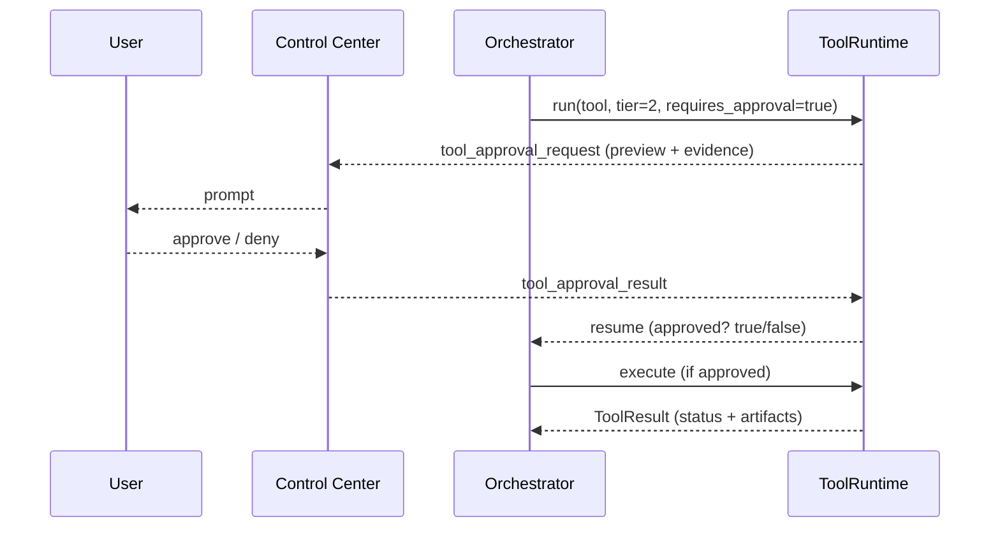
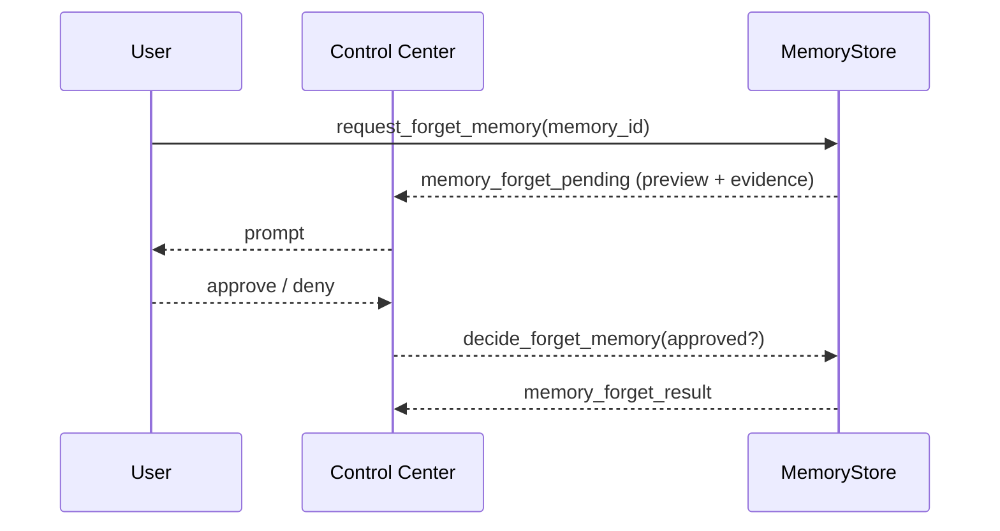
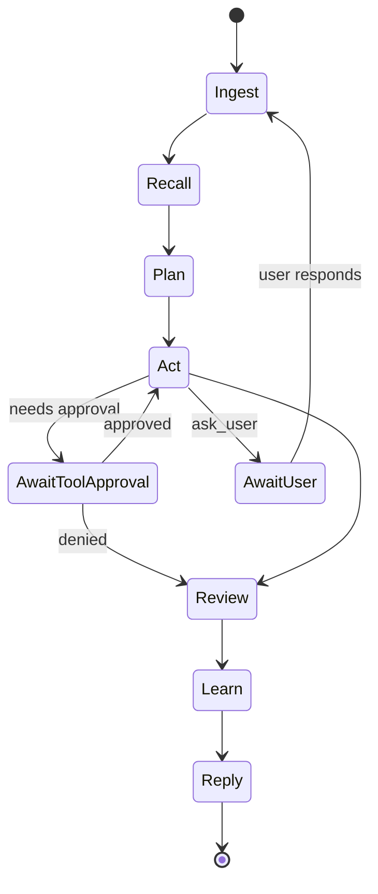
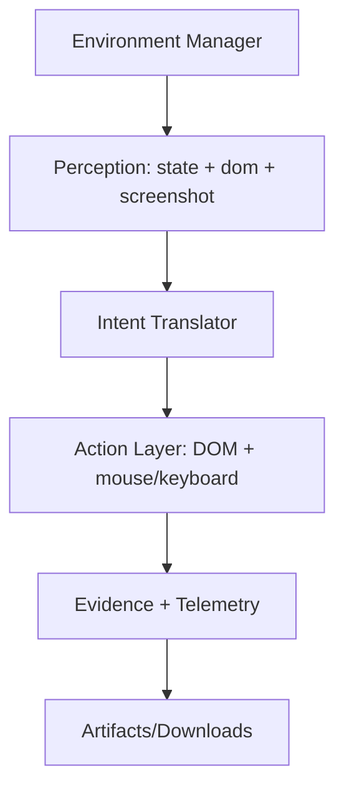
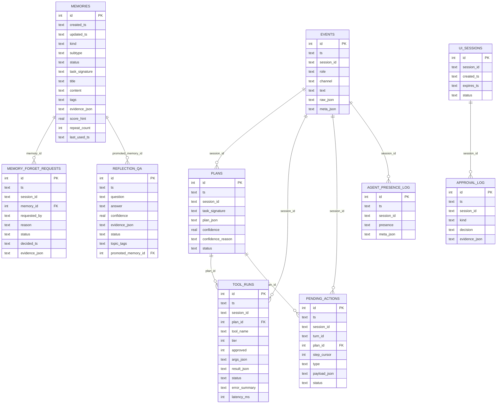

# Stark Assistant

A local-first personal AI assistant for Windows 11, powered by self-hosted models (Ollama), with auditable long-term memory, browser automation, proactive reflection, and a safety-first approval system.

---

## Table of contents

- [Why this exists](#why-this-exists)
- [Core capabilities](#core-capabilities)
- [Safety and privacy model](#safety-and-privacy-model)
- [System architecture](#system-architecture)
- [Workspace layout](#workspace-layout)
- [Tool tiers and approvals](#tool-tiers-and-approvals)
- [Event bus and contracts](#event-bus-and-contracts)
- [Modules](#modules)
- [Data model](#data-model)
- [Local setup](#local-setup)
- [Remote access (optional)](#remote-access-optional)
- [Development workflow](#development-workflow)
- [Testing and replay](#testing-and-replay)
- [Roadmap (MVP build order)](#roadmap-mvp-build-order)

---

## Why this exists

Stark Assistant is designed to feel like a dependable “second brain” that lives on your own machine:

- Stores important context and decisions locally (auditable).
- Executes work through tools with clear evidence and traceability.
- Improves over time via offline reflection without pestering you.
- Stays conservative by default (no web research unless explicitly requested).

---

## Core capabilities

- **SQLite-backed memory**: events, plans, tool runs, durable memories, failures, and approval-gated forgetting.
- **Orchestrator loop**: a resumable agent state machine (ingest → recall → plan → act → review → learn → reply) with no artificial tool-call cap.
- **Operator (browser controller)**: headed Playwright, DOM-first actions, mouse/keyboard fallback, evidence capture, strict gating for irreversible actions.
- **Control Center UI + Session Gateway**: local desktop UI for approvals and trace timeline; gateway supports remote access when you enable it.
- **Skills system**: modular “skill packs” with procedures (“recipes”), tool bindings, and tests.
- **Typed contracts + event bus**: consistent data structures across UI ↔ orchestrator ↔ tools ↔ memory.
- **Model routing**: choose the right model/profile per stage and output format (JSON, patch, prose).
- **Deterministic replay harness**: record-and-replay tool/LLM I/O for debugging and regression tests.
- **Packaging and secrets**: Windows-first installer, safe updates, encrypted secrets, key management.
- **Observability**: redaction, structured logs, crash reports, diagnostics bundles, and exportable audit trails.

---

## Safety and privacy model

### Local-first defaults
- All core data is stored in the workspace on disk (SQLite + artifacts).
- Remote is optional and only for reaching the running assistant; it does not imply cloud storage.

### Web research is opt-in only
- Web browsing/search is disabled unless you explicitly request it for the task.
- “Unknown job” behavior is to ask you for steps/requirements rather than improvising.

### Safe workspace & write boundaries
- Tools only write within configured **SafeRoots** (workspace roots).
- Policy can define a *floor* (tools cannot be downgraded below a minimum tier or allowed to escape SafeRoots).

### Credential handling
- Credentials are never saved to durable memory by default.
- Tool args and logs redact secret-like fields (`<redacted>`).

### Approval-gated actions
- Tiered tool approvals (0/1/2) determine whether actions run automatically or need confirmation.
- Forgetting/deleting durable memory is always approval-gated (soft delete by default).

---

## System architecture

```mermaid
flowchart TD
  User[User (Chat / Remote)] -->|messages| GW[Session Gateway]
  UI[Control Center UI (Qt Desktop)] <--> GW
  GW <--> EB[Event Bus (WS + durable events)]

  GW --> ORCH[Orchestrator Loop]
  ORCH <--> MEM[MemoryStore (SQLite + FTS5)]
  ORCH --> ROUTER[Model Router (profiles + stage rules)]
  ROUTER --> LLMRT[LLM Runtime (STRICT_JSON / CODE_PATCH / PROSE)]
  ORCH --> TR[ToolRuntime (registry + approvals)]
  TR --> OPS[Operator (Playwright headed)]
  TR --> TP[Tool Packs (filesystem/web/pdf/etc)]
  OPS --> ART[Artifacts + Downloads]
  TP --> ART
  MEM <--> ART

  EB <--> ORCH
  EB <--> MEM
  EB <--> TR
  EB <--> OPS
  EB <--> UI
```

---

## Workspace layout

Everything is rooted under a single workspace directory:

```
<workspace>/
  memory/
    stark_memory.db
  artifacts/
    browser/<session_id>/<turn_id>/
    traces/
    reports/
  downloads/
    <session_id>/<turn_id>/
  exports/
    MEMORY_EXPORT.md
    ERROR_PLAYBOOK.md
    RESEARCH_PROCEDURES.md
  config/
    runtime.json
    policy.json
  logs/
    app.log
```

---

## Tool tiers and approvals

| Tier | Meaning | Examples | Default approval |
|---:|---|---|---|
| 0 | Read-only / safe | screenshot, DOM snapshot, extract, local reads within SafeRoots | Runs immediately |
| 1 | Interactive but reversible | click/type/select/scroll, create files within SafeRoots | Requires confirmation (or scoped session grant) |
| 2 | Irreversible / external-state | send/post/submit/pay/delete, uploads, destructive ops | Always requires explicit approval |

Approvals are unified across:
- tool calls (Tier 1/2)
- pending memory promotions (learning candidates)
- forget/delete requests for durable memories

### Tool approval flow




### Pause/resume bridge (pending actions)

When an approval (or required user input) blocks execution, the orchestrator serializes a resumable checkpoint:

- stored in `pending_actions`
- includes `plan_id`, `turn_id`, `step_cursor`, and a typed `payload_json`
- tool approvals store a `pending_action_id` that ToolRuntime uses to resume exactly where it paused

This enables:
- safe “human-in-the-loop” control for Tier 1/2 tools
- reliable continuation after UI reconnects or app restarts


### Memory forget flow



---

## Event bus and contracts

The event bus is the glue between UI, gateway, orchestrator, tools, and memory. Events are sent over WebSocket and also recorded for audit/debug.

### Event envelope (typed)
Common fields (recommended):
- `event_type` (string)
- `ts` (ISO-8601)
- `session_id`
- `turn_id` (optional)
- `correlation_id` (links actions together)
- `payload` (typed content; JSON)
- `meta` (optional)

### High-value event types
- `turn_started`, `ingest_done`, `recall_done`, `plan_saved`
- `tool_approval_request`, `tool_approval_result`
- `tool_run_started`, `tool_run_finished`
- `operator_state_update` (url/title/domain + artifacts)
- `memory_saved` (informational, non-blocking)
- `memory_pending` (approval needed to promote candidate)
- `memory_forget_pending` (approval needed to sunset)
- `trace_event` (timeline entries for the last turn)
- `session_presence_update` (agent/user online status)

### Gateway endpoints (reference)
Typical endpoints for the Session Gateway (FastAPI):
- `GET /health`
- `WS  /ws` (events + commands that are limited to approvals/view state)
- `GET /snapshot` (latest state for UI refresh)
- `POST /approve/tool`
- `POST /approve/memory`
- `POST /approve/forget`
- `GET /artifacts/{path}` (served from workspace, policy-gated)

> Invariant: remote/web surfaces can **approve/deny** and **view state**, but cannot issue arbitrary actions.

---

## Modules

### 1) Memory (SQLite + FTS + exports)

Purpose: local, auditable, evidence-linked memory that improves responses and prevents repeated mistakes.

Key principles:
- Local SQLite DB on disk (no remote storage by default).
- Durable memory writes become **active immediately**.
- Forget/delete/sunset requests are **approval-gated**.
- Dedupe + decay controls to prevent “memory spam”.
- Human-readable exports to Markdown.

Core tables (high level):
- `schema_migrations`
- `events` (append-only source of truth)
- `plans`
- `tool_runs`
- `memories` (durable knowledge)
- `memories_fts` (FTS5 index for retrieval)
Optional/recommended:
- `failures` (structured failure signals)
- `memory_forget_requests` (audit trail for forgetting)

Memory lifecycle:

```mermaid
flowchart LR
  A[Capture: events/plans/tool_runs] --> B[Recall: memories_fts + recent events]
  B --> C[Plan + Act]
  C --> D[Review: success/mismatch/failure]
  D --> E[Learn: upsert durable memories (active immediately)]
  E --> F[Export: Markdown views]
  E -->|forget request| G[pending_delete]
  G -->|approve| H[sunset (soft delete)]
  G -->|deny| I[restore active]
```

Unknown-job trigger (memory match low + planner confidence low):
- Ask for steps/requirements (no web research).
- Store procedure memories as `procedure_user` (or `procedure_web` only when explicitly requested, including sources + freshness metadata).

Unknown-job defaults (tunable):
- `MATCH_THRESHOLD = 0.25`
- `CONF_THRESHOLD  = 0.55`


### 2) Orchestrator loop (resumable state machine)

Stages:
- ingest → recall → plan → act → review → learn → reply

Hard rules:
- Web research disabled unless explicitly enabled for the current turn.
- No hard tool-call cap; long tasks run until success/cancel/stall guard.

State machine sketch:



Structured plan contract (runnable JSON)
- `goal`, `task_signature`
- `confidence`, `confidence_reason`
- `expected_outputs[]` (must be checkable in review)
- `steps[]` where each is `ask_user`, `tool`, or `note/think`
- `stop_conditions` including `stall_guard` (progress/no-progress guard)

Example (minimal):
```json
{
  "goal": "Collect invoice PDFs and summarize totals",
  "task_signature": "invoices pdf summarize",
  "confidence": 0.62,
  "confidence_reason": "Similar procedure exists; needs folder path confirmation",
  "expected_outputs": ["PDFs saved to workspace", "Summary table created"],
  "steps": [
    {"id":"q1","type":"ask_user","question":"Which folder contains the PDFs?","why_needed":"Need path to import","blocks_execution":true},
    {"id":"t1","type":"tool","summary":"List files","tool_call":{"tool_name":"fs.list","args":{"path":"<user_path>"},"tier":0,"requires_approval":false},"done_when":"Files listed","on_fail":"Ask user for updated path"}
  ],
  "stop_conditions": {
    "user_cancelled": true,
    "stall_guard": {"max_retries": 3, "no_progress_turns": 2}
  }
}
```

Failure signals worth learning from:
- tool error
- outcome mismatch (expected outputs not met)
- rejected proposals (including denied approvals)
- explicit user dissatisfaction

### 3) Operator (headed browser controller)

Responsibilities:
- Headed Playwright runtime (visible by default).
- DOM-first actions with robust selector strategy.
- Fallback to browser-scoped mouse/keyboard when DOM targeting is weak.
- Evidence artifacts: screenshots, DOM snapshots, extracts, downloads.

Operator UX knobs:
- `OPERATOR_SLOWMO_MS` (optional pacing)
- optional “highlight target” overlay before clicks/types

Layered architecture:



Safety gates:
- External-state actions are always Tier 2 (send/post/submit/pay/delete/confirm).
- Login flows prefer: user logs in manually → operator continues; secrets redacted in logs.


Operator tools (suggested registry)
- Tier 0 (read-only):
  - `browser.open(url, context_id=None)`
  - `browser.navigate(page_id, url)`
  - `browser.get_state(page_id)`
  - `browser.screenshot(page_id, label=None)`
  - `browser.snapshot_dom(page_id)`
  - `browser.extract(page_id, mode, target=None)` (`text|links|table|html`)
- Tier 1 (interactive):
  - `browser.click_dom(page_id, selector, expect_navigation=false)`
  - `browser.click_role(page_id, role, name, exact=false)`
  - `browser.type_dom(page_id, selector, text, clear_first=true)`
  - `browser.select_dom(page_id, selector, value)`
  - `browser.wait(page_id, condition)`
  - `browser.scroll(page_id, amount_or_selector)`
  - `browser.mouse_click(page_id, x, y)`
  - `browser.mouse_drag(page_id, from_x, from_y, to_x, to_y)`
  - `browser.type_active(page_id, text)`
  - `browser.key(page_id, key_combo)` (e.g. `Ctrl+L`, `Enter`)
- Tier 2 (external-state / irreversible; always gated):
  - `browser.submit(page_id, selector_or_hotkey)`
  - `browser.send_message(page_id, text, target_selector=None)`
  - `browser.confirm_dialog(page_id)`
  - `browser.upload(page_id, file_input_selector, local_path)`
  - `browser.delete_action(page_id, selector)`


Failure taxonomy (stable error classes for learning)
- `selector_not_found`
- `element_not_clickable` (overlay/intercept)
- `navigation_blocked` (cookie/consent)
- `login_required`
- `captcha_detected`
- `unexpected_modal`
- `download_failed`
- `upload_failed`
- `submit_blocked_by_policy` (needs Tier 2 approval)
- `ambiguous_target` (needs user clarification)


### 4) Proactive idle loop / reflection engine (no spam)

Runs when idle (no user activity, not awaiting approvals, not mid-tool execution). Goals:
- Offline reflection on DB (always allowed).
- Internal self Q/A loop that stores results without cluttering user-facing memory.
- Owner model candidates as **pending** memories (approval-gated).
- Self model stats (reliability, common failures, recommended fallbacks).
- Maintenance jobs: dedupe, consolidation proposals, staleness checks, exports.
- Optional online watchlists (explicitly enabled only).

Recommended internal tables:
- `reflection_qa` (question, answer, confidence, evidence, status)
- `unresolved_gaps` (questions that should only be asked if blocking)
- `self_profile` (capabilities, reliability stats, limitations)
- `digests` (non-durable watchlist results; stored as DB rows or events)
- `watchlists` (or store watchlist entries as preference memories)

Timezone semantics:
- all schedules use Asia/Kuala_Lumpur timestamps.

Idle defaults (tunable):
- `IDLE_AFTER_MINUTES = 10`
- Rate limits (anti-spam): max new pending memories per hour: 3; max owner-model candidates per run: 1; max maintenance proposals per run: 2
- Confidence bands: `HIGH_CONF = 0.80`, `MED_CONF = 0.55` (below MED → unresolved gap)


### 5) Control Center UI + Session Gateway

Control Center (Qt desktop):
- approvals queue (tool + memory + forget)
- trace timeline
- session list + presence
- artifact viewer (screenshots/downloads)
- debug panels (optional)

Session Gateway (FastAPI + WS):
- local UI channel and optional remote channel
- state snapshots for UI refresh (`GET /snapshot`)
- WS stream (`/ws`) for live events
- minimal “command surface” limited to approvals and view operations

Recommended gateway tables (if persisted):
- `auth_tokens` (hashed tokens, revocations)
- `ui_sessions` (issued sessions with expiry)
- `agent_presence_log` (presence transitions)
- `pending_actions` (tool approvals + resume state)
- `approval_log` (audit-friendly decisions)

### 6) Skills system (skill packs + registry)

Skill packs are add-on bundles that can be installed/enabled independently.

A typical pack contains:
- `pack.yaml` (name, version, dependencies)
- `skill.yaml` (triggers, inputs/outputs schema, recipes, tests)
- `recipes/` (procedure docs; can map to research memories)
- `tools/` (optional tool extensions)
- `tests/` (pack-level tests)

### 7) Core data contracts + event bus

Typed contracts unify:
- plans (STRICT_JSON)
- tool call args/results
- operator observations
- approval payloads
- trace events
- memory save/forget events

### 8) LLM routing + model profiles

Routing chooses models by stage and output type:
- planning vs tool reasoning vs review vs summarization
- strict JSON vs patch format vs prose explanation

Example Ollama profiles:
- general reasoning: `qwen3:30b`
- code edits: `qwen3-coder:30b`
- lightweight: `qwen3:4b`, `qwen2.5:3b-instruct`, `qwen2.5-coder:3b-instruct`

### 9) LLM runtime + structured output + adapter

Output modes:
- `STRICT_JSON`: validated and repaired on failure (with retry rules)
- `CODE_PATCH`: minimal diffs/patches (auditable)
- `PROSE`: plain explanations

Adapters:
- normalize provider differences
- unify streaming vs non-streaming
- standardize token usage/latency metrics

### 10) Core tool packs + workspace sandbox

Tools are grouped into packs (filesystem, browser, PDF/data transforms, etc). The sandbox:
- enforces SafeRoots
- prevents writing outside workspace unless explicitly approved and policy-allowed
- normalizes artifact paths and logging

### 11) Testing + replay harness

Record-and-replay:
- tool I/O cassettes (args/result, redacted)
- LLM prompts/responses (redacted)
- deterministic time controls (timezone-aware)
- replayed runs produce identical plans/decisions for regression testing

### 12) Packaging/installer + updates + secrets

Windows-first:
- installer bootstraps workspace + config
- optional autostart (Task Scheduler)
- safe update strategy with rollback
- encrypted secrets store (owner-controlled keys)

### 13) Configuration + policy (one place for knobs)

Two primary files (recommended):
- `config/runtime.json`: ports, paths, model endpoints, debug flags
- `config/policy.json`: SafeRoots, tool tiers, remote access, web research gating, quiet hours, autonomy level

Policy concepts:
- SafeRoots are an allowlist of writable roots
- tool tier overrides per tool name
- “never downgrade below floor” (e.g., external-state stays Tier 2)
- per-session grants with expiration (interactive domain grants)
- optional config history tables:
  - `config_versions` (serialized snapshots)
  - `config_audit` (who/when/why for changes)

### 14) Observability + redaction + crash forensics

- structured logs (JSON lines recommended)
- redaction rules applied to tool args and LLM payloads
- crash bundles include:
  - last trace events
  - last tool runs + error summaries
  - environment snapshot (non-sensitive)
- exportable diagnostics for local troubleshooting

---

## Data model

Core ER (expanded):

Additional (recommended) tables that may exist even if not shown in the ER above:
- `digests` (watchlist outputs)
- `watchlists` (enabled topics + schedules)
- `config_versions`, `config_audit` (config history)




---

## Local setup

> Windows 11 is the primary target.

### Prerequisites
- Python 3.11+ (recommended)
- Ollama installed and running locally
- Playwright for the headed browser operator

### Install models (example)
```bash
ollama pull qwen3:30b
ollama pull qwen3-coder:30b
ollama pull qwen3:4b
```

### Create a virtual environment
```bash
python -m venv .venv
.venv\Scripts\activate
pip install -U pip
pip install -r requirements.txt
```

### Install Playwright browsers
```bash
python -m playwright install
```

### Configure workspace
1. Create `<workspace>` folder (see [Workspace layout](#workspace-layout)).
2. Set `MEMORY_DB_PATH` (default: `<workspace>/memory/stark_memory.db`).
3. Edit `config/runtime.json` and `config/policy.json`.
4. Start the gateway + orchestrator, then launch the Control Center.

> A `scripts/bootstrap_workspace.ps1` helper is recommended for first-time setup.

---

## Remote access (optional)

Remote access is for reaching the assistant while away; data still stays local.

Supported patterns:
- **Tailscale** (private overlay network)
- **Cloudflare Tunnel** (public endpoint with strong auth)
- **Token auth**:
  - store token hashes (Argon2 recommended)
  - optional TOTP second factor
  - short-lived UI sessions (`ui_sessions`) with expiry + revocation

---

## Development workflow

### Suggested repo structure
```
stark-assistant/
  apps/
    gateway/          # FastAPI + WS
    control_center/   # Qt UI
    orchestrator/
  stark/
    memory/
    tools/
    operator/
    skills/
    contracts/
    llm/
    config/
    observability/
  tests/
  scripts/
```

### Adding a skill pack
1. Create `skills/packs/<pack_name>/pack.yaml`
2. Add one or more `skill.yaml` files with triggers, schemas, recipes, tests
3. Register pack in the Skill Registry
4. Add replay harness fixtures where useful

### Adding a tool
1. Implement inside a tool pack (e.g. `stark/tools/packs/filesystem.py`)
2. Register in ToolRegistry with:
   - name, default tier, risk flags
   - argument/result schema
3. Ensure ToolRuntime logs `tool_runs` and emits approval + completion events

---

## Testing and replay

- Unit tests validate:
  - schema migrations
  - plan JSON validation
  - unknown-job gate logic
  - SafeRoots enforcement
  - approval state serialization/resume
- Integration tests use:
  - deterministic mock pages (cookie banners, login gates, downloads)
  - recorded tool and LLM cassettes
- Replay harness enables:
  - regression tests across versions
  - diagnosis of failures without re-running external interactions

---

## Roadmap (MVP build order)

1. **Session Gateway skeleton**: chat I/O + `/ws` events + `/snapshot`.
2. **MemoryStore**: schema_migrations + capture + memories_fts + exports.
3. **Orchestrator loop**: plan → act (mock tools) → review → learn → reply.
4. **ToolRuntime + approvals**: pending_actions + pause/resume.
5. **Operator minimal**: headed browser + screenshot/extract (Tier 0).
6. **Control Center**: approvals UI + trace timeline.
7. **Skills registry**: pack loading + procedures/recipes.
8. **Replay harness**: record/replay tool + LLM I/O.
9. **Packaging + secrets**: installer, encrypted secrets, update strategy.
10. **Reflection engine**: reflection_qa + maintenance proposals.
11. **Observability**: redaction + crash reporting + diagnostics bundle.
