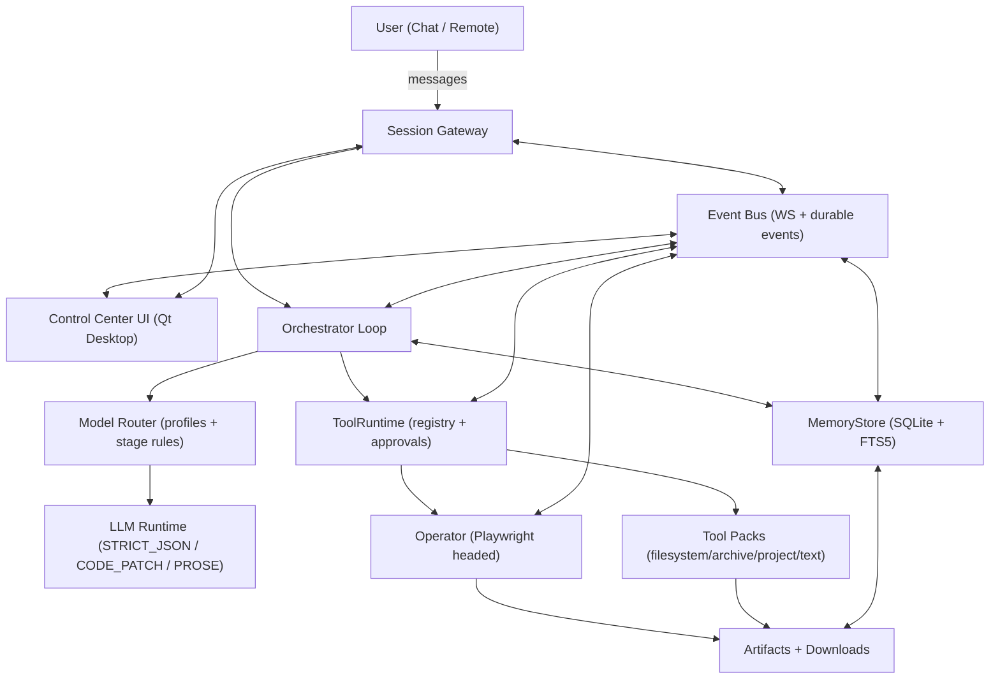
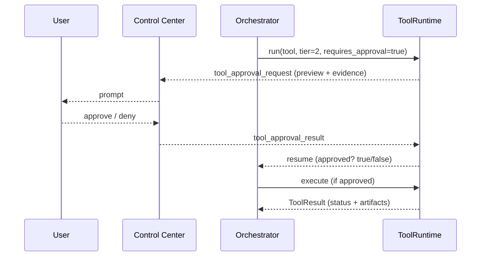
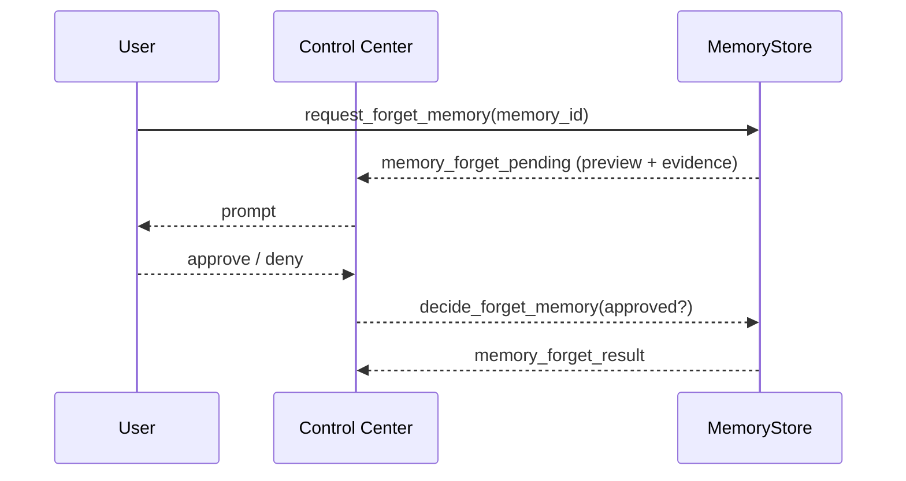
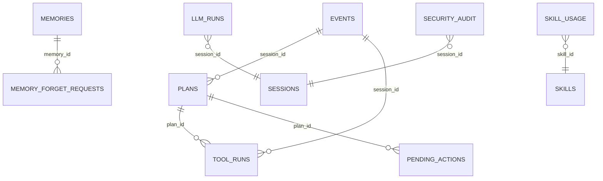

# Stark Assistant

A local-first personal AI assistant for Windows 11, powered by self-hosted models (Ollama, BitNet), with auditable long-term memory, browser automation, proactive reflection, and a safety-first approval system.  
**Current build status**: Core infrastructure (contracts, configuration, observability, core tools, memory, LLM runtime) completed; routing, orchestrator, operator, UI, and advanced features in progress.

---

## Table of contents

- [Why this exists](#why-this-exists)
- [Core capabilities](#core-capabilities)
- [Safety and privacy model](#safety-and-privacy-model)
- [System architecture](#system-architecture)
- [Workspace layout](#workspace-layout)
- [Tool tiers and approvals](#tool-tiers-and-approvals)
- [Event bus and contracts](#event-bus-and-contracts)
- [Modules overview](#modules-overview)
- [Data model](#data-model)
- [Local setup](#local-setup)
- [Remote access (optional)](#remote-access-optional)
- [Development workflow](#development-workflow)
- [Testing and replay](#testing-and-replay)
- [Roadmap (build order)](#roadmap-mvp-build-order)

---

## Why this exists

Stark Assistant is designed to feel like a dependable “second brain” that lives on your own machine:

- Stores important context and decisions locally (auditable).
- Executes work through tools with clear evidence and traceability.
- Improves over time via offline reflection without pestering you.
- Stays conservative by default (no web research unless explicitly requested).

---

## Core capabilities

- **SQLite-backed memory**: events, plans, tool runs, durable memories, failures, and approval-gated forgetting. Full-text search (FTS5) for recall.
- **Orchestrator loop** (in progress): a resumable agent state machine (ingest → recall → plan → act → review → learn → reply) with no artificial tool-call cap, stall guard, and unknown‑job detection.
- **Operator (browser controller)**: headed Playwright, DOM‑first actions, mouse/keyboard fallback, evidence capture, strict gating for irreversible actions.
- **Control Center UI + Session Gateway** (in progress): local desktop UI (Qt) and optional web‑based approval panel. Real‑time event stream, approvals queue, trace timeline, artifact viewer.
- **Skills system** (planned): modular “skill packs” with declarative recipes or Python entrypoints; safe install (approval‑gated) and sandboxed execution.
- **Typed contracts + event bus**: consistent data structures across UI ↔ orchestrator ↔ tools ↔ memory. All messages validated, versioned, and persisted for replay.
- **Model routing + profiles**: choose the right model per stage and output format (STRICT_JSON, CODE_PATCH, PROSE). Supports Ollama and BitNet (short‑form only). Learned overrides based on health metrics.
- **LLM runtime with structured output**: enforces output contracts, repairs JSON, validates code patches, logs every call (`llm_runs`).
- **Proactive idle loop** (planned): offline reflection, self‑Q/A, memory maintenance, and opt‑in watchlists – all without user spam.
- **Deterministic replay harness**: record‑and‑playback sessions for debugging, regression testing, and time‑travel debugging.
- **Packaging and secrets**: Windows‑first installer (Portable ZIP / EXE), safe updates (atomic swap + rollback), encrypted secrets (DPAPI), token hashing, mandatory redaction.
- **Observability**: targeted redaction, structured logs, crash bundles, error memories (deduplicated), self‑profile updates.
- **Self‑improving system** (planned): learned overrides, skill generation from successful plans, crash avoidance, and periodic fine‑tuning of models using memory data.
- **Security Ops** (planned): Blue Team (low‑overhead detection, threat scoring, reversible lockdown) and Red Team lab mode (scoped, time‑limited self‑testing).

---

## Safety and privacy model

### Local‑first defaults
- All core data is stored in the workspace on disk (SQLite + artifacts).
- Remote access is optional and only for reaching the running assistant; it does not imply cloud storage.

### Web research is opt‑in only
- Web browsing/search is disabled unless you explicitly request it for the task.
- “Unknown job” behavior is to ask you for steps/requirements rather than improvising.

### Safe workspace & write boundaries
- Tools only write within configured **SafeRoots** (workspace roots).
- Policy can define a *floor* (tools cannot be downgraded below a minimum tier or allowed to escape SafeRoots).

### Credential handling
- Credentials are never saved to durable memory by default.
- Tool args and logs redact secret‑like fields (`<redacted>`).

### Approval‑gated actions
- Tiered tool approvals (0/1/2) determine whether actions run automatically or need confirmation.
- Forgetting/deleting durable memory is always approval‑gated (soft delete by default).
- Memory writes (learning) are auto‑saved as ACTIVE; only forget requests require approval.

---

## System architecture



---

## Workspace layout

Everything is rooted under a single workspace directory:

```
<workspace>/
  memory/
    stark_memory.db
  artifacts/
    browser/<session_id>/<turn_id>/
    diffs/
    reports/
  downloads/
    <session_id>/<turn_id>/
  skills/
    packs/                # user‑installed skill packs
    inbox/                # zip drop for approval‑gated install
  config/
    runtime.json
    policy.yaml
    llm_routing.yaml
  logs/
    app.jsonl
  crash_bundles/
  exports/
    MEMORY_EXPORT.md
    ERROR_PLAYBOOK.md
    RESEARCH_PROCEDURES.md
  tmp/                     # scratch space
```

---

## Tool tiers and approvals

| Tier | Meaning | Examples | Default approval |
|---:|---|---|---|
| 0 | Read‑only / safe | screenshot, DOM snapshot, extract, local reads within SafeRoots | Runs immediately |
| 1 | Interactive but reversible | click/type/select/scroll, create files within SafeRoots | Requires confirmation (or scoped session grant) |
| 2 | Irreversible / external‑state | send/post/submit/pay/delete, uploads, destructive ops | Always requires explicit approval |

Approvals are unified across:
- tool calls (Tier 1/2)
- pending memory promotions (learning candidates)
- forget/delete requests for durable memories

### Tool approval flow



### Memory forget flow



---

## Event bus and contracts

The event bus is the glue between UI, gateway, orchestrator, tools, and memory. Events are sent over WebSocket and also recorded for audit/debug. All messages conform to typed Pydantic contracts with versioning and correlation IDs.

### Event envelope (typed)
- `event_type` (string), `schema_version`, `id` (uuid), `ts_utc`
- `session_id`, `turn_id`, `trace_id`, `parent_id`
- `severity`, `scope` (`ui`, `audit`, `internal`)
- `payload` (typed content; JSON)

### High‑value event types
- `turn_started`, `ingest_done`, `recall_done`, `plan_saved`
- `tool_approval_request`, `tool_approval_result`
- `tool_run_started`, `tool_run_finished`
- `operator_state_update` (url/title/domain + artifacts)
- `memory_saved`, `memory_pending`, `memory_forget_pending`
- `trace_event` (timeline entries)
- `session_presence_update` (agent/user online status)
- `security.alert_raised`, `security.lockdown_started` (security module)

### Gateway endpoints (reference)
- `GET /health`
- `WS  /ws` (events + limited commands)
- `GET /snapshot` (latest state for UI refresh)
- `POST /approve/tool`, `POST /approve/memory`, `POST /approve/forget`
- `GET /artifacts/{path}`

> Invariant: remote/web surfaces can **approve/deny** and **view state**, but cannot issue arbitrary actions.

---

## Modules overview

The project is organized into the following modules, each with a clear status:

| Module | Description | Status |
|--------|-------------|--------|
| **1. Core Data Contracts + Event Bus** | Typed contracts, event registry, in‑process pub/sub, SQLite event log, replay API. | ✅ **DONE** |
| **2. Configuration + Policy** | Layered config (YAML + DB), effective snapshot, policy engine (tiers, safe roots, approvals). | ✅ **DONE** |
| **3. Observability + Redaction + Crash Forensics** | Structured JSONL logs, trace timeline, targeted redaction, crash bundles + error memories. | ✅ **DONE** |
| **4. Core Tool Packs + Workspace Sandbox** | `fs.*`, `project.*`, `archive.*`, `text.*` tools with evidence (diffs/snapshots), stable error codes. | ✅ **DONE** |
| **5. Memory Module** | SQLite tables (`events`, `plans`, `tool_runs`, `memories`, `failures`), FTS recall, auto‑save, approval‑gated forget. | ✅ **DONE** |
| **6. LLM Runtime + Structured Output** | Unified generate API, adapters (Ollama, BitNet), STRICT_JSON/CODE_PATCH validation/repair, `llm_runs` logging. | ✅ **DONE** |
| **7. LLM Routing + Model Profiles** | Model registry, task classifier, deterministic router with fallback chains, learned overrides. | 🟡 **DOING** |
| **8. Orchestrator Loop** | Stage machine (ingest→…→reply), plan JSON, stall guard, approvals pause/resume, unknown‑job detection. | ⏳ **TODO** |
| **9. Operator (Computer Controller)** | Headed Playwright, DOM‑first actions, human‑like fallback, Tier‑2 gating, login/captcha handling. | ⏳ **TODO** |
| **10. Control Center UI + Session Gateway** | Local Qt UI, web‑based approvals panel, connection health, artifact viewer, voice I/O (planned). | 🟡 **IN PROGRESS** |
| **11. Skills System** | Pack discovery, declarative/Python skills, safe install (approval‑gated), skill usage tracking. | ⏳ **TODO** |
| **12. Proactive Idle Loop + Reflection** | Idle scheduler, self‑Q/A, watchlists (opt‑in), memory maintenance, owner‑model candidates. | ⏳ **TODO** |
| **13. Testing + Replay Harness** | Replay bundles (events + frames), scenario DSL, golden assertions, regression test automation. | ⏳ **TODO** |
| **14. Packaging + Updates + Secrets** | PyInstaller EXEs, workspace bootstrap, autostart (Task Scheduler), atomic updates, DPAPI secrets. | ⏳ **TODO** |
| **15. Self‑Improving System Integration** | Learned overrides, skill generation, crash avoidance, fine‑tuning pipeline (BitNet + memory data). | ⏳ **TODO** |
| **16. Alignment Rules** | Doc‑to‑code consistency locks (e.g., BitNet usage, memory semantics). | ⏳ **TODO** |
| **17. Documentation + Operations Runbooks** | Architecture docs, onboarding, backup/restore, upgrade, incident handling. | ⏳ **TODO** |
| **18. Security Operations (MVP)** | Blue Team (signal collection, scoring, reversible lockdown), Red Team lab mode (scoped self‑testing). | ⏳ **TODO** |

---

## Data model

Core ER (simplified):



Additional tables:
- `bus_events` (append‑only event log)
- `llm_models`, `llm_runs`, `llm_model_health`
- `skill_packs`, `skills`, `skill_usage`
- `security_audit`, `security_allowlist`
- `idle_jobs`, `reflection_qa`, `unresolved_gaps`

---

## Local setup

> Windows 11 is the primary target.

### Prerequisites
- Python 3.11+
- Ollama installed and running locally (optional, for heavy models)
- Playwright for the headed browser operator

### Install models (example)
```bash
ollama pull qwen3:30b
ollama pull qwen3-coder:30b
ollama pull qwen2.5:3b-instruct
# BitNet models (optional) – see docs
```

### Create a virtual environment
```bash
python -m venv .venv
.venv\Scripts\activate
pip install -U pip
pip install -r requirements.txt
```

### Install Playwright browsers
```bash
python -m playwright install
```

### Configure workspace
1. Choose or create `<workspace>` folder (see [Workspace layout](#workspace-layout)).
2. Run first‑time setup (via `starkctl bootstrap` or UI wizard).
3. Edit `config/runtime.json` and `config/policy.yaml` as needed.
4. Start the gateway + orchestrator, then launch the Control Center.

> A `scripts/bootstrap_workspace.ps1` helper is provided for first‑time setup.

---

## Remote access (optional)

Remote access is for reaching the assistant while away; data still stays local.

Supported patterns:
- **Tailscale** (private overlay network)
- **Cloudflare Tunnel** (public endpoint with strong auth)
- **Token auth**:
  - store token hashes (Argon2) in `secrets` table
  - optional TOTP second factor
  - short‑lived UI sessions with expiry + revocation

---

## Development workflow

### Suggested repo structure
```
stark-assistant/
  apps/
    gateway/          # FastAPI + WS
    control_center/   # Qt UI
    orchestrator/
  assistant/
    contracts/
    memory/
    tools/
    operator/
    skills/
    llm/              # runtime + routing
    config/
    observability/
    security/         # Blue/Red Team
    reflection_engine/
  tests/
  scripts/
  docs/
```

### Adding a tool pack
1. Create `assistant/tools/packs/<pack_name>/` with `__init__.py` and register function.
2. Implement tools returning `ToolResult` with evidence (diffs/snapshots).
3. Update ToolRegistry on startup.

### Adding a skill pack
1. Create `<workspace>/skills/packs/<pack_name>/` with `pack.yaml` and `skill.yaml`.
2. Use declarative recipes or Python entrypoints.
3. Run `starkctl skills reload` to load.

---

## Testing and replay

- **Unit tests**: validate contracts, policy decisions, path safety, etc.
- **Integration tests**: end‑to‑end scenarios with mock tools and recorded LLM responses.
- **Replay harness**: export real sessions as replay bundles (events + frames), play back in UI, or run regression tests with deterministic assertions.
- **Scenario DSL**: script user inputs, approvals, tool outcomes to verify complex behaviors.
- **Golden assertions**: catch regressions in tiering, memory writes, stage wiring.

---

## Roadmap (MVP build order)

The project is built module‑by‑module according to the checklist. Current focus:

1. ✅ **Module 1–6**: Contracts, Config, Observability, Core Tools, Memory, LLM Runtime (complete).
2. 🟡 **Module 7**: LLM Routing (in progress).
3. ⏳ **Module 8**: Orchestrator Loop.
4. ⏳ **Module 9**: Operator.
5. 🟡 **Module 10**: Control Center UI + Gateway (in progress).
6. ⏳ **Module 11**: Skills System.
7. ⏳ **Module 12**: Proactive Idle Loop.
8. ⏳ **Module 13**: Testing + Replay Harness.
9. ⏳ **Module 14**: Packaging + Updates + Secrets.
10. ⏳ **Module 15**: Self‑Improving System.
11. ⏳ **Modules 16–18**: Alignment, Docs, Security Ops.

For the latest status, see the [checklist](docs/Stark_Personal_Assistant_Checklist_v7.txt).