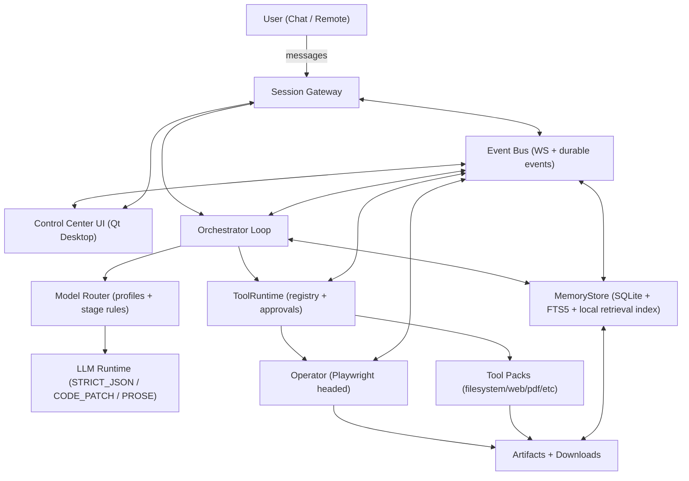
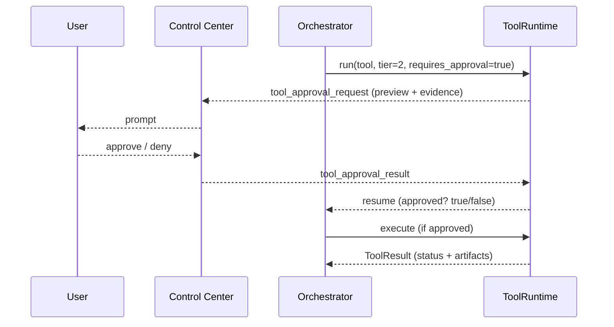
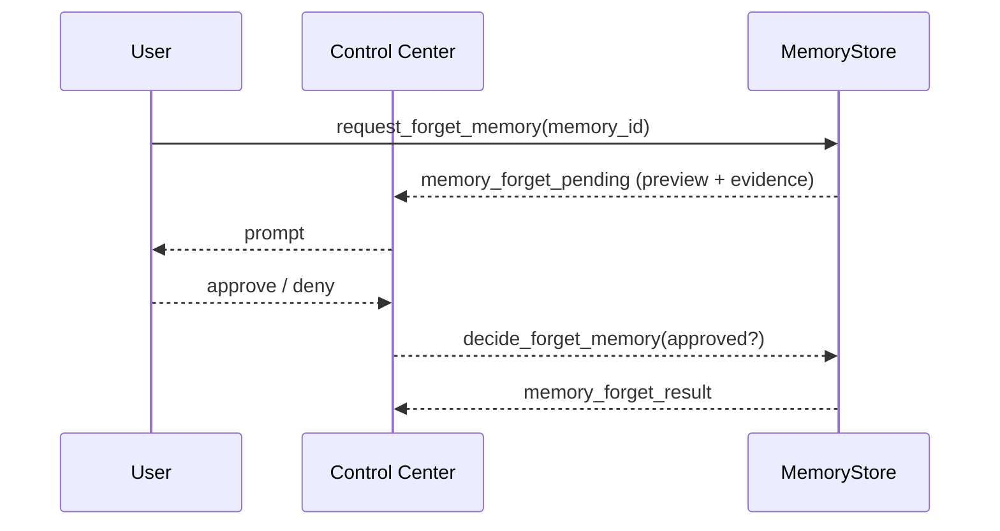
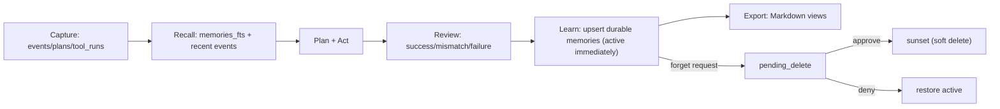
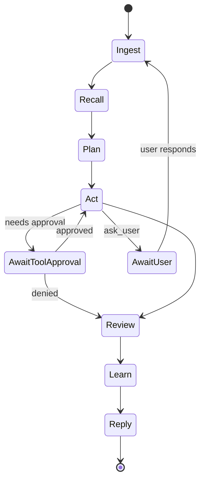
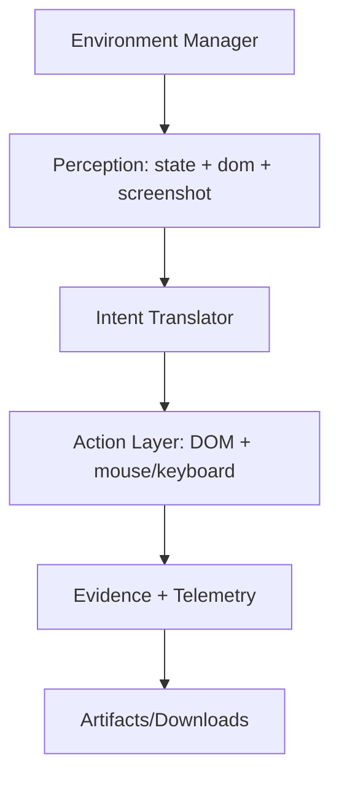
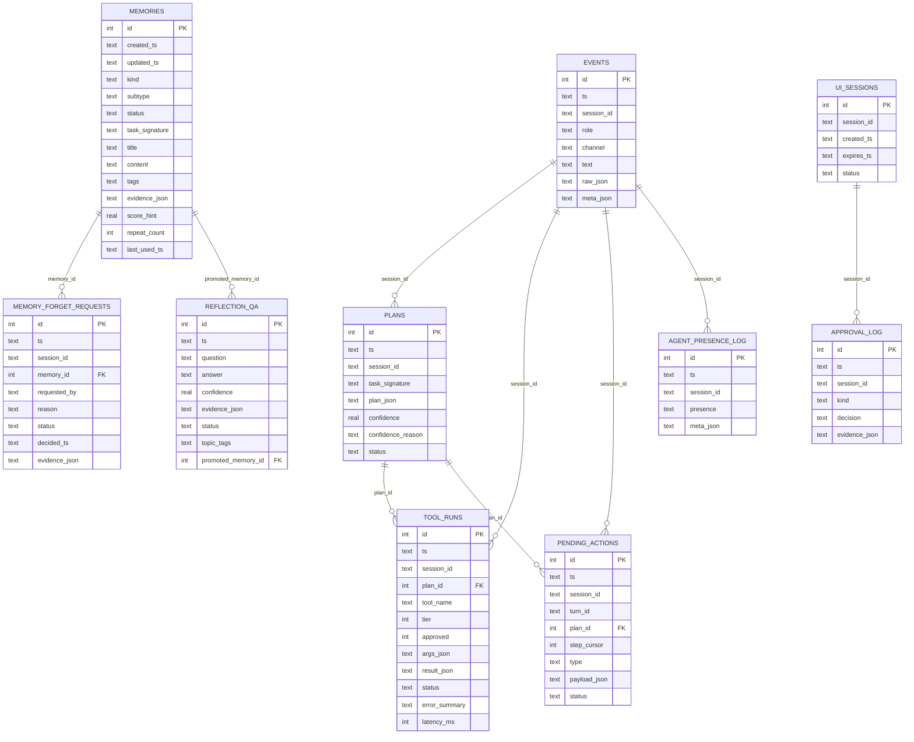

# Stark Assistant

**Version:** v1.20.5-beta

A local-first personal AI assistant for Windows 11, powered by self-hosted models (Ollama), with auditable long-term memory, browser automation, proactive reflection, and a safety-first approval system.

---

## Table of contents

- [Why this exists](#why-this-exists)
- [Core capabilities](#core-capabilities)
- [Safety and privacy model](#safety-and-privacy-model)
- [System architecture](#system-architecture)
- [Alignment docs and examples](#alignment-docs-and-examples)
- [Workspace layout](#workspace-layout)
- [Tool tiers and approvals](#tool-tiers-and-approvals)
- [Event bus and contracts](#event-bus-and-contracts)
- [Modules](#modules)
- [Data model](#data-model)
- [Local setup](#local-setup)
- [Remote access (optional)](#remote-access-optional)
- [Development workflow](#development-workflow)
- [Testing and replay](#testing-and-replay)
- [Roadmap (MVP build order)](#roadmap-mvp-build-order)

---

## Why this exists

Stark Assistant is designed to feel like a dependable “second brain” that lives on your own machine:

- Stores important context and decisions locally (auditable).
- Executes work through tools with clear evidence and traceability.
- Improves over time via offline reflection without pestering you.
- Stays conservative by default (no web research unless explicitly requested).

---

## Core capabilities

- **SQLite-backed memory**: events, plans, tool runs, durable memories, failures, and approval-gated forgetting.
- **Orchestrator loop**: a resumable agent state machine (ingest → recall → plan → act → review → learn → reply) with no artificial tool-call cap.
- **Operator (browser controller)**: headed Playwright, DOM-first actions, mouse/keyboard fallback, evidence capture, strict gating for irreversible actions.
- **Control Center UI + Session Gateway**: local desktop UI for approvals and trace timeline; gateway supports remote access when you enable it.
- **Skills system**: modular “skill packs” with procedures (“recipes”), tool bindings, and tests.
- **Reflex registry substrate**: typed, reviewable, versioned reflex contracts with local install/load/list/disable/revert registry behavior. M22.1 defines the governed registry only; M22.2 adds local mined candidate records backed by repeated successful traces, but candidates remain review-only, non-executable, and separate from the installed registry. M22.3 adds a strictly bounded direct-execution slice for installed approved low-risk `tool_contract` reflexes only; explicit direct calls still route through shipped `ToolRuntime` policy, SafeRoots, receipts, and disable/revert controls, and normal shipped turns may now try an installed reflex before the full planner with an explicit planner fallback when routing is blocked or not applicable.
- **Governed coding patch pipeline**: M23.2 keeps the typed coding-task + patch-plan contracts from M23.1 and now adds a bounded local validation/apply/rollback path. Stark can validate a reviewable patch in a copied sandbox repo, apply it only through the controlled declared-scope path, record before/after checkpoints plus apply receipts, and restore the previous state explicitly through checkpoint-backed rollback. The shipped HUD now consumes the existing coding snapshot surface so bounded validation/apply/block/rollback outcomes remain visible through normal snapshot resync and replay bundle hydration. The path stays local-first, reviewable, and scope-bounded; it is not an autonomous repo-rewrite loop.
- **Coding-task mining bridge**: M23.3 adds a local-first mining pass over shipped coding evidence under `state/coding/` and routes bounded recurring coding-workflow candidates into the existing Module 22 reflex-candidate store. Mining stays deterministic, report-backed, and review-only: safe repeated patterns such as workspace-scoped version-sync/doc/report chores can become `ready_for_review` candidates, sensitive or broad patterns are blocked with explicit reasons, and mined records never auto-install or auto-execute.
- **Typed contracts + event bus**: consistent data structures across UI ↔ orchestrator ↔ tools ↔ memory.
- **Model routing**: choose the right model/profile per stage and output format (JSON, patch, prose).
- **Deterministic replay harness**: record-and-replay tool/LLM I/O for debugging and regression tests.
- **Packaging, launch, and secrets**: current local-launch, update rollback, and secret-handling surfaces exist; M118 adds a bounded Python installer/uninstall contract with strict workspace-marker/install-id delete guards and explicit backup/restore helpers, while a signed Windows installer package remains a separate packaging frontier.
- **Observability**: redaction, structured logs, crash reports, diagnostics bundles, and exportable audit trails.

---

## Safety and privacy model

### Local-first defaults
- All core data is stored in the workspace on disk (SQLite + artifacts).
- Remote is optional and only for reaching the running assistant; it does not imply cloud storage.

### Web research is opt-in only
- Web browsing/search is disabled unless you explicitly request it for the task.
- “Unknown job” behavior is to ask you for steps/requirements rather than improvising.

### Safe workspace & write boundaries
- Tools only write within configured **SafeRoots** (workspace roots).
- Policy can define a *floor* (tools cannot be downgraded below a minimum tier or allowed to escape SafeRoots).

### Credential handling
- Credentials are never saved to durable memory by default.
- Tool args and logs redact secret-like fields (`<redacted>`).

### Approval-gated actions
- Tiered tool approvals (0/1/2) determine whether actions run automatically or need confirmation.
- Forgetting/deleting durable memory is always approval-gated (soft delete by default).

---

## System architecture


```mermaid
flowchart TD
  User["User (Chat / Remote)"] -->|messages| GW[Session Gateway]
  UI["Control Center UI (Qt Desktop)"] <--> GW
  GW <--> EB["Event Bus (WS + durable events)"]

  GW --> ORCH[Orchestrator Loop]
  ORCH <--> MEM["MemoryStore (SQLite + FTS5 + local retrieval index)"]
  ORCH --> ROUTER["Model Router (profiles + stage rules)"]
  ROUTER --> LLMRT["LLM Runtime (STRICT_JSON / CODE_PATCH / PROSE)"]
  ORCH --> TR["ToolRuntime (registry + approvals)"]
  TR --> OPS["Operator (Playwright headed)"]
  TR --> TP["Tool Packs (filesystem/web/pdf/etc)"]
  OPS --> ART[Artifacts + Downloads]
  TP --> ART
  MEM <--> ART

  EB <--> ORCH
  EB <--> MEM
  EB <--> TR
  EB <--> OPS
  EB <--> UI
```

---

## Alignment docs and examples

For the current anti-drift docs/examples foundation, use these pages together instead of relying on old chat memory or stale proposal ordering:

- `docs/architecture/runtime_map.md` - current runtime map, module dependency graph, build-order summary, and maturity labels
- `docs/architecture/alignment_rules.md` - locked wording/invariants for approvals, one-controller, no-web-by-default, durable-vs-pending memory, BitNet scope, and error-memory carry-forward
- `docs/architecture/security_foundations.md` - Module 18 defensive-first security foundations, Blue/Red profile truth, dedicated security-event names, and security-audit separation boundaries
- `docs/architecture/security_monitoring_mvp.md` - Module 18 Blue Team monitoring MVP truth-lock: Windows-first lightweight signals, dedupe/scoring helpers, alert thresholds, and packet-capture-future-only wording
- `docs/architecture/security_response_coordination.md` - Module 18 Blue Team response coordination truth-lock: local-only recommendation/start/release flow, reversible-first snapshot/recovery state, and break-glass/stale-state validation boundaries
- `docs/architecture/security_red_lab_self_tests.md` - Module 18 Red Lab self-test safe-set truth-lock: Stark/self-assessment checks, prompt/tool-abuse validation, privacy-aware findings reports, optional canary extension, and retest/compare linkage
- `docs/architecture/security_ui_reporting_runbooks.md` - Module 18 security UI/reporting/runbook truth-lock: local Security page precursor-level truth, separate Blue/Red reports, redaction-safe rendered exports, and security-specific operator runbooks
- `docs/architecture/security_resource_privacy_learning_boundaries.md` - Module 18 privacy/resource/learning-boundary truth-lock: conservative retention, training/export exclusion, defer/yield reasons, read-only remote alert visibility, and honest always-on-boundary wording
- `docs/operator/bitnet_routing_cpu_first_runbook.md` - current BitNet/routing/CPU-first operating notes, fallback behavior, and troubleshooting
- `docs/skills/skill_pack_authoring_review.md` - current skill-pack template/review/install guidance grounded in the existing template, validator, sandbox, and proposal runtime
- `docs/operator/replay_regression_debug_workflow.md` - durable replay bundle examples, regression-queue promotion/quarantine flow, and failed-run debug workflow
- `examples/skills/user_pack_template/` - the current user-pack template, including python and command-template examples
- `examples/replay/` - a committed scenario spec plus a small sanitized replay-bundle example for local read-only walkthroughs
- `docs/operator/local_operations_runbook.md` - current local start/stop/status, manual update/rollback, backup/restore, and install-vs-workspace boundary notes
- `docs/operator/incident_observability_runbook.md` - current incident/debug evidence flow for trace, diagnostics, crash bundles, replay, bug-package assembly, and redaction-safe sharing
- `docs/operator/voice_privacy_runbook.md` - current voice/STT/TTS privacy defaults, local-only limits, mute/DND rules, and capability-honest troubleshooting
- `docs/operator/first_week_with_stark_fleet.md` - current first-week local onboarding checklist with replay, idle-job, and backup/restore drills

These pages are support truth for M120 only. They do **not** widen the repo into automatic skill installation, always-on connector automation, a full operations portal, or a broader self-improving runtime.

---

## Workspace layout

Everything is rooted under a single workspace directory:

```
<workspace>/
  memory/
    stark_memory.db
  artifacts/
    browser/<session_id>/<turn_id>/
    traces/
    reports/
  downloads/
    <session_id>/<turn_id>/
  exports/
    MEMORY_EXPORT.md
    ERROR_PLAYBOOK.md
    RESEARCH_PROCEDURES.md
  config/
    runtime.json
    policy.json
  logs/
    app.log
```

---

## Tool tiers and approvals

| Tier | Meaning | Examples | Default approval |
|---:|---|---|---|
| 0 | Read-only / safe | screenshot, DOM snapshot, extract, local reads within SafeRoots | Runs immediately |
| 1 | Interactive but reversible | click/type/select/scroll, create files within SafeRoots | Requires confirmation (or scoped session grant) |
| 2 | Irreversible / external-state | send/post/submit/pay/delete, uploads, destructive ops | Always requires explicit approval |

Approvals are unified across:
- tool calls (Tier 1/2)
- pending memory promotions (learning candidates)
- forget/delete requests for durable memories

### Tool approval flow


```mermaid
sequenceDiagram
  participant U as User
  participant UI as Control Center
  participant O as Orchestrator
  participant T as ToolRuntime

  O->>T: run(tool, tier=2, requires_approval=true)
  T-->>UI: tool_approval_request (preview + evidence)
  UI-->>U: prompt
  U-->>UI: approve / deny
  UI-->>T: tool_approval_result
  T-->>O: resume (approved? true/false)
  O->>T: execute (if approved)
  T-->>O: ToolResult (status + artifacts)
```


### Pause/resume bridge (pending actions)

When an approval (or required user input) blocks execution, the orchestrator serializes a resumable checkpoint:

- stored in `pending_actions`
- includes `plan_id`, `turn_id`, `step_cursor`, and a typed `payload_json`
- tool approvals store a `pending_action_id` that ToolRuntime uses to resume exactly where it paused

This enables:
- safe “human-in-the-loop” control for Tier 1/2 tools
- reliable continuation after UI reconnects or app restarts


### Memory forget flow


```mermaid
sequenceDiagram
  participant U as User
  participant UI as Control Center
  participant M as MemoryStore

  U->>M: request_forget_memory(memory_id)
  M-->>UI: memory_forget_pending (preview + evidence)
  UI-->>U: prompt
  U-->>UI: approve / deny
  UI-->>M: decide_forget_memory(approved?)
  M-->>UI: memory_forget_result
```

---

## Event bus and contracts

The event bus is the glue between UI, gateway, orchestrator, tools, and memory. Events are sent over WebSocket and also recorded for audit/debug.

### Event envelope (typed)
Common fields (current contract surface):
- `schema_version`
- `type`
- `id`
- `session_id`
- `turn_id` / `trace_id` / `parent_id` (when meaningful)
- `ts_utc` (canonical UTC ISO-8601)
- `now_local` (Asia/Kuala_Lumpur UI display helper when present)
- `scope` / `severity`
- `refs` (shared evidence/correlation IDs)
- `payload` (typed content; JSON)

### High-value event types
- `session.started`, `turn.started`, `turn.ended`, `plan.created`
- `approval.tool.request`, `approval.tool.response`
- `approval.memory.request`, `approval.memory.response`
- `tool.result`, `tool_run.update`
- `memory.pending`, `memory.approved`, `memory.rejected`
- `trace.event`, `presence.update`, `operator.failure`

### Gateway endpoints (reference)
Typical endpoints for the Session Gateway (FastAPI):
- `GET /health`
- `WS  /ws` (events + commands that are limited to approvals/view state)
- `GET /snapshot` (latest state for UI refresh)
- `POST /approve/tool`
- `POST /approve/memory`
- `POST /approve/forget`
- `GET /artifacts/{path}` (served from workspace, policy-gated)

> Invariant: remote/web surfaces can **approve/deny** and **view state**, but cannot issue arbitrary actions.

---

## Modules

### 1) Memory (SQLite + FTS + exports)

Purpose: local, auditable, evidence-linked memory that improves responses and prevents repeated mistakes.

Key principles:
- Local SQLite DB on disk (no remote storage by default).
- Durable memory writes become **active immediately**.
- Forget/delete/sunset requests are **approval-gated**.
- Dedupe + decay controls to prevent “memory spam”.
- Human-readable exports to Markdown.
- Module 21 retrieval foundations stay local-only and derived: `assistant/retrieval/*` builds chunk/index artifacts under `workspace/index/` from durable memory rows and linked workspace files without replacing SQLite authority.
- Module 21 / M21.2 now lets the orchestrator attach bounded, source-linked retrieval grounding to planning and tool-use preparation. Those retrieval hits remain supporting context only, carry source/trust/scope/visibility/sensitivity metadata, persist exact durable linkage (`source_pointer`, `durable_source_id`, and linked memory IDs) through tool-run storage redaction, and degrade honestly when the local index is missing or has no matching evidence.
- Module 21 / M21.3 adds local retrieval evaluation and observability on the shipped path: each planning/tool-use retrieval run now records bounded status/hit-count/source-link/rank-score coverage metrics under `workspace/eval/retrieval_events.jsonl` and rolls up local metrics in `workspace/reports/retrieval_metrics.json`, while the existing gateway/HUD trace surface exposes compact operator-visible retrieval summaries without turning derived retrieval artifacts into a second authority source.
- Frozen memory taxonomy for this phase: `preference | fact | project | rule | research | error`; invalid kinds/subtypes are rejected at contract boundaries.

Core tables (high level):
- `schema_migrations`
- `events` (append-only source of truth)
- `plans`
- `tool_runs`
- `memories` (durable knowledge)
- `memories_fts` (FTS5 index for recall)
- `workspace/index/*` (derived local retrieval chunks + lexical/metadata indexes; rebuildable from durable truth)
Optional/recommended:
- `failures` (structured failure signals)
- `memory_forget_requests` (audit trail for forgetting)

Memory lifecycle:


```mermaid
flowchart LR
  A[Capture: events/plans/tool_runs] --> B[Recall: memories_fts + recent events]
  B --> C[Plan + Act]
  C --> D[Review: success/mismatch/failure]
  D --> E["Learn: upsert durable memories (active immediately)"]
  E --> F[Export: Markdown views]
  E -->|forget request| G[pending_delete]
  G -->|approve| H["sunset (soft delete)"]
  G -->|deny| I[restore active]
```

Unknown-job trigger (memory match low + planner confidence low):
- Ask for steps/requirements (no web research).
- Store procedure memories as `procedure_user` (or `procedure_web` only when explicitly requested, including sources + freshness metadata).

Unknown-job defaults (tunable):
- `MATCH_THRESHOLD = 0.25`
- `CONF_THRESHOLD  = 0.55`


### 2) Orchestrator loop (resumable state machine)

Stages:
- ingest → recall → plan → act → review → learn → reply

Hard rules:
- Web research disabled unless explicitly enabled for the current turn.
- No hard tool-call cap; long tasks run until success/cancel/stall guard.

State machine sketch:


```mermaid
stateDiagram-v2
  [*] --> Ingest
  Ingest --> Recall
  Recall --> Plan
  Plan --> Act
  Act --> AwaitToolApproval: needs approval
  AwaitToolApproval --> Act: approved
  AwaitToolApproval --> Review: denied
  Act --> AwaitUser: ask_user
  AwaitUser --> Ingest: user responds
  Act --> Review
  Review --> Learn
  Learn --> Reply
  Reply --> [*]
```

Structured plan contract (runnable JSON)
- `goal`, `task_signature`
- `confidence`, `confidence_reason`
- `expected_outputs[]` (must be checkable in review)
- `steps[]` where each is `ask_user`, `tool`, or `note/think`
- `stop_conditions` including `stall_guard` (progress/no-progress guard)

Example (minimal):
```json
{
  "goal": "Collect invoice PDFs and summarize totals",
  "task_signature": "invoices pdf summarize",
  "confidence": 0.62,
  "confidence_reason": "Similar procedure exists; needs folder path confirmation",
  "expected_outputs": ["PDFs saved to workspace", "Summary table created"],
  "steps": [
    {"id":"q1","type":"ask_user","question":"Which folder contains the PDFs?","why_needed":"Need path to import","blocks_execution":true},
    {"id":"t1","type":"tool","summary":"List files","tool_call":{"tool_name":"fs.list","args":{"path":"<user_path>"},"tier":0,"requires_approval":false},"done_when":"Files listed","on_fail":"Ask user for updated path"}
  ],
  "stop_conditions": {
    "user_cancelled": true,
    "stall_guard": {"max_retries": 3, "no_progress_turns": 2}
  }
}
```

Failure signals worth learning from:
- tool error
- outcome mismatch (expected outputs not met)
- rejected proposals (including denied approvals)
- explicit user dissatisfaction

### 3) Operator (headed browser controller)

Responsibilities:
- Headed Playwright runtime (visible by default).
- DOM-first actions with robust selector strategy.
- Fallback to browser-scoped mouse/keyboard when DOM targeting is weak.
- Evidence artifacts: screenshots, DOM snapshots, extracts, downloads.

Operator UX knobs:
- `OPERATOR_SLOWMO_MS` (optional pacing)
- optional “highlight target” overlay before clicks/types

Layered architecture:


```mermaid
flowchart TB
  Env[Environment Manager] --> Per[Perception: state + dom + screenshot]
  Per --> Tx[Intent Translator]
  Tx --> Act[Action Layer: DOM + mouse/keyboard]
  Act --> Ev[Evidence + Telemetry]
  Ev --> Store[Artifacts/Downloads]
```

Safety gates:
- External-state actions are always Tier 2 (send/post/submit/pay/delete/confirm).
- Login flows prefer: user logs in manually → operator continues; secrets redacted in logs.


Operator tools (suggested registry)
- Tier 0 (read-only):
  - `browser.open(url, context_id=None)`
  - `browser.navigate(page_id, url)`
  - `browser.get_state(page_id)`
  - `browser.screenshot(page_id, label=None)`
  - `browser.snapshot_dom(page_id)`
  - `browser.extract(page_id, mode, target=None)` (`text|links|table|html`)
- Tier 1 (interactive):
  - `browser.click_dom(page_id, selector, expect_navigation=false)`
  - `browser.click_role(page_id, role, name, exact=false)`
  - `browser.type_dom(page_id, selector, text, clear_first=true)`
  - `browser.select_dom(page_id, selector, value)`
  - `browser.wait(page_id, condition)`
  - `browser.scroll(page_id, amount_or_selector)`
  - `browser.mouse_click(page_id, x, y)`
  - `browser.mouse_drag(page_id, from_x, from_y, to_x, to_y)`
  - `browser.type_active(page_id, text)`
  - `browser.key(page_id, key_combo)` (e.g. `Ctrl+L`, `Enter`)
- Tier 2 (external-state / irreversible; always gated):
  - `browser.submit(page_id, selector_or_hotkey)`
  - `browser.send_message(page_id, text, target_selector=None)`
  - `browser.confirm_dialog(page_id)`
  - `browser.upload(page_id, file_input_selector, local_path)`
  - `browser.delete_action(page_id, selector)`


Failure taxonomy (stable error classes for learning)
- `selector_not_found`
- `element_not_clickable` (overlay/intercept)
- `navigation_blocked` (cookie/consent)
- `login_required`
- `captcha_detected`
- `unexpected_modal`
- `download_failed`
- `upload_failed`
- `submit_blocked_by_policy` (needs Tier 2 approval)
- `ambiguous_target` (needs user clarification)


### 4) Proactive idle loop / reflection engine (no spam)

Runs when idle (no user activity, not awaiting approvals, not mid-tool execution). Goals:
- Offline reflection on DB (always allowed).
- Internal self Q/A loop that stores results without cluttering user-facing memory.
- Owner model candidates as **pending** memories (approval-gated).
- Self model stats (reliability, common failures, recommended fallbacks).
- Maintenance jobs: dedupe, consolidation proposals, staleness checks, exports.
- Optional online watchlists (explicitly enabled only).

Recommended internal tables:
- `reflection_qa` (question, answer, confidence, evidence, status)
- `unresolved_gaps` (questions that should only be asked if blocking)
- `self_profile` (capabilities, reliability stats, limitations)
- `digests` (non-durable watchlist results; stored as DB rows or events)
- `watchlists` (or store watchlist entries as preference memories)

Timezone semantics:
- all schedules use Asia/Kuala_Lumpur timestamps.

Idle defaults (tunable):
- `IDLE_AFTER_MINUTES = 10`
- Rate limits (anti-spam): max new pending memories per hour: 3; max owner-model candidates per run: 1; max maintenance proposals per run: 2
- Confidence bands: `HIGH_CONF = 0.80`, `MED_CONF = 0.55` (below MED → unresolved gap)


### 5) Control Center UI + Session Gateway

Control Center (Qt desktop):
- approvals queue (tool + memory + forget)
- trace timeline
- session list + presence
- artifact viewer (screenshots/downloads)
- debug panels (optional)

Session Gateway (FastAPI + WS):
- local UI channel and optional remote channel
- state snapshots for UI refresh (`GET /snapshot`)
- WS stream (`/ws`) for live events
- minimal “command surface” limited to approvals and view operations

Recommended gateway tables (if persisted):
- `auth_tokens` (hashed tokens, revocations)
- `ui_sessions` (issued session snapshots with connect/disconnect status and hash-only auth material)
- `agent_presence_log` (presence transitions)
- `pending_actions` (tool approvals + resume state)
- `approval_log` (audit-friendly decisions)

### 6) Skills system (skill packs + registry)

Skill packs are add-on bundles that can be installed/enabled independently.

A typical pack contains:
- `pack.yaml` (name, version, dependencies)
- `skill.yaml` (triggers, inputs/outputs schema, recipes, tests)
- `recipes/` (procedure docs; can map to research memories)
- `tools/` (optional tool extensions)
- `tests/` (pack-level tests)

### 7) Core data contracts + event bus

Typed contracts unify:
- plans (STRICT_JSON)
- tool call args/results
- operator observations
- approval payloads
- trace events
- memory save/forget events

### 8) LLM routing + model profiles

Routing chooses models by stage and output type:
- planning vs tool reasoning vs review vs summarization
- strict JSON vs patch format vs prose explanation

Example Ollama profiles:
- general reasoning: `qwen3:30b`
- code edits: `qwen3-coder:30b`
- lightweight: `qwen3:4b`, `qwen2.5:3b-instruct`, `qwen2.5-coder:3b-instruct`

### 9) LLM runtime + structured output + adapter

Output modes:
- `STRICT_JSON`: validated and repaired on failure (with retry rules)
- `CODE_PATCH`: minimal diffs/patches (auditable)
- `PROSE`: plain explanations

Adapters:
- normalize provider differences
- unify streaming vs non-streaming
- standardize token usage/latency metrics

### 10) Core tool packs + workspace sandbox

Tools are grouped into packs (filesystem, browser, PDF/data transforms, etc). The sandbox:
- enforces SafeRoots
- prevents writing outside workspace unless explicitly approved and policy-allowed
- normalizes artifact paths and logging

### 11) Testing + replay harness

Record-and-replay:
- tool I/O cassettes (args/result, redacted)
- LLM prompts/responses (redacted)
- deterministic time controls (timezone-aware)
- replayed runs produce identical plans/decisions for regression testing

### 12) Packaging/installer + updates + secrets

Windows-first proof currently stays bounded to:
- manual local launch/readiness through `scripts/run_local_hud.py`
- config snapshot / reload-state / rollback precedent through the config store surfaces
- health / validation entry points through the local HUD `/health`, `scripts/verify_all.py`, and targeted `scripts/auto_test_*` helpers
- encrypted secret-handling surfaces where implemented

This README path does **not** prove a finished installer, auto-bootstrap, or app-update workflow yet.

#### Current Module 14 ship-target lock-in

Current repo truth is a **shipping frontier**, not a fully productized installer/updater stack.

Current entrypoints and boundaries:
- **Control Center current entrypoint:** `python scripts/run_local_hud.py`
  - current supported flags: `--host`, `--port`, `--workspace-root`
  - default bind stays `127.0.0.1` and default port stays `8765`
  - current Windows convenience wrapper is `assistant/ui/hud/run.bat`, which now delegates to the same launcher path rather than a static-only ad-hoc server
- **Backend service current owner:** `assistant.gateway.fastapi_local_ui.create_local_ui_app(...)`
  - current shipped local launcher starts this app when FastAPI/uvicorn are installed
  - current health/readiness path is `GET /health` on the local HUD server
  - `assistant.gateway.http_server.run_gateway_http(...)` remains a bounded/dev-only debug HTTP surface, not the primary packaged Control Center path
- **Shipping CLI:** `starkctl` is **not implemented in the current repo truth** and must stay described as planned shipping scope only

Default ports and path discovery:
- `install_dir` / extracted folder root: the repo root or extracted portable folder that contains `scripts/run_local_hud.py`
- `workspace_dir`: repo/Python runs default to `<install_dir>/workspace`; frozen/package runs default to a user-owned workspace; both may be overridden explicitly with `--workspace-root`
- runtime config location: `<workspace_dir>/config/*.yaml`
- built-in defaults: `assistant/config_defaults/*.yaml`
- current gateway config defaults define `http_port: 8765` and `ws_port: 8766` in `assistant/config_defaults/gateway.yaml`; the current manual HUD launcher proves the `8765` local HTTP path directly and does **not** by itself prove a separately packaged `8766` ship target
- generated runtime content stays under the chosen workspace (`logs/`, `reports/`, `artifacts/`, `crash_bundles/`, `exports/`, `state/`) and is **not** the same thing as shipped assets
- release-boundary truth stays explicit: source code lives in the repo checkout, shipped assets are the extracted/package payloads called out by the layout plan + manifests, runtime-generated state belongs under the active workspace, and workspace data remains operator-owned rather than part of build/dist/release trees

Install types and deliverables:
- **Portable ZIP — current bounded path**
  - run-from-folder/manual local launch
  - no registry changes proven by this repo path
  - workspace bootstrap is local-first: the launcher uses adjacent `workspace/` by default and now allows an explicit `--workspace-root` override instead of hiding that rule in code
  - current shipped asset families are the extracted repo/runtime surfaces such as `README.md`, `VERSION`, `scripts/`, `assistant/`, `docs/`, and `workspace/config_example/`
  - generated workspace state remains separate under the chosen workspace (`logs/`, `reports/`, `artifacts/`, `crash_bundles/`, `exports/`, `state/`, `config/`)
- **Installer contract — current bounded repo path**
  - installer choice is explicit as a Python manifest installer MVP layered over the versioned PyInstaller payload/current-pointer layout
  - install wizard choices remain explicit for install root, workspace root, dependency install, autostart, and LAN/local-only mode
  - uninstall, backup/restore, workspace-marker/install-id delete guards, and installer-created firewall cleanup rules are now explicit repo-proofed contract surfaces
  - this still does **not** prove a signed Windows installer package, universal shell-link registration, or live system firewall registration on every host

#### M108 PyInstaller MVP build-output baseline

M108 introduces a **bounded PyInstaller MVP packaging slice**, not a finished Windows installer/update product flow.

Packaging approach and output roots:
- **Packaging approach:** PyInstaller remains the MVP build path unless explicitly changed later
- **Build roots:** `build/pyinstaller/<version>/...`, `dist/pyinstaller/<version>/...`, and `release/pyinstaller/<version>/...`
- **Separation rule:** `build/`, `dist/`, and `release/` are build-output trees only; runtime/workspace/generated content still belongs under the selected workspace root (repo runs default adjacent, frozen runs default per-user) or an explicit `--workspace-root` override
- **Version authority:** `VERSION` remains the primary release/build authority and packaging helpers read it through `assistant.app_version.get_release_version(...)`

Current bounded executable specs:
- **Control Center PyInstaller MVP target:** `packaging/pyinstaller/control_center_local_hud.spec`
  - entry script: `scripts/run_local_hud.py`
  - packaged resources: `assistant/ui/hud`, `assistant/config_defaults`, `workspace/config_example`, `README.md`, `VERSION`
  - packaged runtime path discovery stays dynamic: frozen builds resolve install root from the EXE location and default workspace to a user-owned per-user location unless `--workspace-root` overrides it
- **Backend debug HTTP PyInstaller MVP target:** `packaging/pyinstaller/backend_debug_http.spec`
  - entry script: `scripts/run_gateway_debug_http.py`
  - this remains a bounded debug-only backend packaging surface, **not** the main shipped Control Center path
  - packaged config/schema inputs remain explicit: `assistant/config_defaults`, `workspace/config_example`, `docs/schemas/config`, and migration code under `assistant/memory/sqlite_migrations.py`
- **Shipping CLI:** `starkctl` is still **not implemented in current repo truth**, so no PyInstaller CLI spec is claimed yet

Build helper and manifest rules:
- `scripts/build_windows_pyinstaller_mvp.py plan` writes the versioned layout plan under `release/pyinstaller/<version>/layout_plan.json`
- `scripts/build_windows_pyinstaller_mvp.py manifest --target <target>` writes `release/pyinstaller/<version>/<target>/manifest.json` from the current `dist/` tree with file list + SHA-256 hashes
- `scripts/build_windows_pyinstaller_mvp.py build --target <target>` is Windows-first and bounded: it requires PyInstaller locally and can optionally smoke-run the built EXE with `--help` when the host environment allows
- manifest output is the current integrity surface for packaged-file enumeration and hashes; it does **not** by itself prove updater/rollback/installer maturity

Current-state honesty boundary:
- this repo now proves a bounded PyInstaller MVP layout/spec/build-manifest slice
- the checked-in repo currently contains the versioned layout plan and packaging specs, not committed Windows-built EXE binaries
- this repo still does **not** prove a finished installer builder, uninstall flow, updater, rollback stack, or finished DPAPI-backed secrets-store product flow
- packaged EXE runtime validation remains host-conditional and must stay described that way unless later repo work proves broader Windows build automation directly

#### M110 dependency + workspace-init baseline

M110 adds a **bounded dependency/bootstrap/workspace-init slice**, not a finished installer or zero-touch onboarding flow.

#### M112 autostart + greet-on-login + crash-recovery baseline

M112 adds a **bounded Windows-first autostart/greeting/watchdog slice**, not a finished installer/service/update product flow.

Autostart mode and task rules:
- **Autostart MVP:** per-user Task Scheduler at logon remains the primary bounded path
- **Primary launch target:** Control Center (`scripts/run_local_hud.py`) stays the default autostart target
- **Explicit managed backend:** the optional debug backend path is only enabled when `--managed-backend-mode debug_http` is passed; default remains `none`
- **Alternate backend-only path:** `scripts/manage_windows_autostart.py --mode backend_only_optional ...` remains optional/documented and must not be silently mixed into the main Control Center task
- **Task metadata:** task name, `ONLOGON` trigger, `LIMITED` run level, current-user scope, working directory, and environment are rendered explicitly into a workspace-owned launcher script under `workspace/operator/autostart/`

Greeting contract:
- login greeting uses the current local timezone (`Asia/Kuala_Lumpur` by default through current config defaults)
- greeting events are persisted through `autostart.greeting` in the memory DB plus `state/autostart_greeting_state.json`
- duplicate suppression remains bounded by a 20-minute rate-limit window
- UI/tray notice remains optional only: `--greeting-ui-notice` marks the event with an optional toast hint and does **not** prove a finished tray integration by itself

Crash-recovery/watchdog contract:
- Control Center watchdog supervision is bounded to the explicit managed debug backend path only
- restart budget remains bounded (default: 3 restarts per 15 minutes)
- crash signatures are redacted safely and routed into existing crash-bundle / crash-error-memory surfaces through `CrashReporter` + `SqliteEventLog`
- watchdog state remains workspace-owned under `state/autostart_watchdog_state.json` and `state/autostart_watchdog_events.db`

Current-state honesty boundary:
- this repo now proves a bounded per-user Task Scheduler plan/launcher/helper surface and a bounded login-greeting/watchdog runtime contract
- it does **not** yet prove universal Windows-host Task Scheduler execution from this environment
- it does **not** prove a finished tray app, installer, uninstall flow, updater, rollback stack, DPAPI-backed packaged secrets store, or `starkctl` implementation

Dependency/bootstrap ownership:
- `assistant/workspace/runtime_init.py` is the shared bootstrap owner for install-root discovery, workspace-root discovery, canonical runtime-owned folder creation, marker-file writing, Playwright dependency-state handling, SQLite memory DB bootstrap, and `state/runtime.json` writing
- `scripts/init_workspace_runtime.py` is the explicit manual helper for `init`, `playwright-status`, `defer-playwright`, `install-playwright`, and `ollama-health`
- current repo truth for workspace selection is still explicit/manual (`--workspace-root` and the bootstrap helper), not a separately proven richer interactive chooser flow yet
- both `scripts/run_local_hud.py` and `scripts/run_gateway_debug_http.py` now use the same helper so repo-run and frozen-aware bootstrap rules stay aligned

Workspace/runtime boundaries:
- install root still means the repo root or extracted folder that contains the launcher entrypoint
- user-owned default workspace for frozen/package runs resolves outside the install root so Program Files-style installs do not force runtime state into packaged locations
- repo/Python runs keep the adjacent local-first default `<install_dir>/workspace`; frozen/package runs default to a user-owned per-user workspace; explicit selection still uses `--workspace-root`
- canonical runtime-owned folders now explicitly include `config/`, `state/`, `reports/`, `exports/`, `operator/`, `operator/dependencies/`, `operator/dependencies/playwright-browsers/`, and `operator/profiles/` in addition to the already-proven local workspace/logging/artifact roots
- `.stark_workspace_root.json` is the bounded workspace ownership/discovery marker for safe bootstrap and future uninstall protection
- `state/runtime.json` is the bounded runtime state file and keeps only essential install/workspace/path/port/bootstrap status; secrets do **not** belong there, and malformed/secret-bearing files are self-healed back to the canonical shape

Dependency strategy:
- Playwright browser assets are workspace-owned runtime dependencies, not shipped/source-authority assets
- the install/download target remains `<workspace>/operator/dependencies/playwright-browsers` via `PLAYWRIGHT_BROWSERS_PATH`
- install progress stays visible by streaming `python -m playwright install <browser>` output
- deferred install remains explicit through `state/playwright_dependency_state.json`
- already-installed detection and explicit headed-launch validation remain bounded helper surfaces rather than silent assumptions
- Ollama is still **not bundled**; the current health check is read-only and only reports reachable / missing / unreachable / probe-error state without pretending startup is blocked

Local-by-default shipping constraints:
- LAN reachability stays opt-in by changing `--host`; default bind is loopback/local-only
- remote/web surfaces remain bounded to approve/deny/view-state rules rather than arbitrary command authority
- redaction remains mandatory for logs, replay/export, crash bundles, diagnostics, and sensitive tool/runtime traces
- existing targeted redaction foundations predate M116 and remain the primary proof surface for logs, replay/export, crash bundles, diagnostics, and related persisted outputs
- DPAPI-like strings are redacted heuristically in observability surfaces where detected, but the current repo does **not** yet prove a finished Windows DPAPI-backed secrets-storage product flow
- M116 adds a bounded SQLite-backed `SecretsStore` / token-registry slice under `assistant/security/secrets_store.py`: metadata-only listing, explicit scope rules, current-user-bound protector adapters, hash-only tokens at rest, explicit revocation rows, and rotation helpers. The Windows DPAPI adapter is implemented, while non-Windows tests prove the contract through a test-only current-user-bound protector rather than claiming live Windows-host validation here.
- historical M106 boundary: autostart is not yet implemented in the current repo truth. M112 supersedes that older boundary with the bounded per-user Task Scheduler MVP described below.
- per-user Task Scheduler launch path is now the bounded autostart MVP; the helper writes a workspace-owned launcher under `workspace/operator/autostart/` and the Windows registration/query/remove commands remain host-conditional through `scripts/manage_windows_autostart.py`
- duplicate Control Center autostart launches are now prevented through a workspace-owned launch guard at `state/autostart_launch_state.json` / `state/autostart_control_center.lock`, so repeated logon/task overlaps do not silently start a second local HUD process
- Control Center-managed backend start remains explicit via `--managed-backend-mode`; the default launcher stays `none` so backend-only and Control Center paths are not mixed silently
- login greeting event is timezone-aware, rate-limited, and persisted via the workspace-owned `state/autostart_greeting_state.json` plus a durable `autostart.greeting` memory-db event
- the optional Control Center watchdog supervises only the explicit managed debug backend path, restarts it within a bounded budget, emits explicit warning output when the retry budget is exhausted, and feeds safe crash signatures into crash-bundle/error-memory surfaces
- `starkctl` autostart commands remain planned only (`enable-autostart`, `disable-autostart`, `status-autostart`, `test-autostart`) until a real CLI surface exists
- Windows-host-specific Task Scheduler registration/execution remains host-conditional; this repo proves the plan/launcher/registration helper surface, not universal success on every non-Windows environment
- M113 keeps that current-state proof boundary explicit: until a real Windows-host validation pass exists, Task Scheduler execution proof remains planned/future-facing rather than implied complete from this environment alone

#### M114 safe update + rollback baseline

M114 adds a **bounded manual local-first update slice**, not a finished network updater, silent hot-swap, installer builder, or enterprise rollback stack.

Manual update surface:
- the manual UI lives at `assistant/ui/hud/update.html` and is served by the local HUD backend at `/ui/update.html`
- the current/available version and channel remain visible through `/api/ui/update/status` and `/api/ui/update/check`
- explicit progress/status remains visible through `/api/ui/update/download` and `/api/ui/update/apply`; the page shows check/download/verify/apply/health-check/rollback/restart steps rather than hiding them behind a single opaque action

Download, staging, and integrity rules:
- the local feed path remains workspace-owned at `<workspace>/operator/updates/update_feed.json`
- payload download stages into `<workspace>/operator/updates/staging/<version>/` and remains separate from the active/current install path
- stage metadata keeps expected SHA-256, actual SHA-256, bytes copied, total bytes, and retry/resume state explicit in `stage_metadata.json`
- partial download and retry behavior are explicit: `.part` files resume rather than silently restarting from zero
- MVP integrity verification is SHA-256 only; signature verification remains a later hardening path and is shown that way in the UI/state

Atomic swap + rollback rules:
- versioned installs land under `<install_authority_root>/versions/<version>/`
- the active/current indirection file is `<install_authority_root>/current-install.json`
- update-owned stable launchers (`run_current_hud.py`, `run_current_gateway_debug_http.py`, `run_current_hud.bat`) are regenerated against the current pointer so later launches target the active version rather than a stale hard-coded path
- the backend-stop step is explicit before pointer swap in updater state/progress; current repo truth still does **not** claim a live in-process self-stop/hot-replace of the active Local HUD server
- DB backup is mandatory before migration/health-check boot and is written under `<workspace>/reports/update_db_backups/<timestamp>/`
- post-swap health-check boot runs through the target version's `scripts/init_workspace_runtime.py init ...` path
- automatic rollback is explicit on failed health-check: the previous pointer is restored and the DB backup is restored according to the bounded restore policy
- successful apply remains explicit about restart: this slice prepares the next active version and then requires a manual Control Center restart instead of claiming live in-process hot replacement

Replay/version metadata alignment:
- replay bundle `manifest.json` now records `runtime.app_version` and `runtime.memory_schema_version`
- replay load responses now expose compatibility warnings when bundle app/schema versions differ from the current runtime
- tool-pack/skills compatibility constraints remain explicit as `not_version_gated_yet` in this repo truth; do not overstate a stronger ABI contract than the current repo proves

Current-state honesty boundary:
- this repo now proves a bounded local update feed + staging + SHA-256 verification + versioned install folder + current-pointer + DB-backup/health-check/rollback contract
- M115 keeps that proof wording aligned with the bounded runtime slice: discovery/download/staging remains explicit, corrupted payloads are blocked by SHA-256 verification, pointer swap + rollback stay explicit, DB backup still precedes migration/health-check boot, and replay metadata mismatch warnings stay visible
- it still does **not** prove a finished remote auto-updater, code-signing/signature verification pipeline, zero-downtime in-process self-update, installer/uninstall builder maturity, updater service, or broader fleet rollout automation

#### M118 installer + uninstall + final acceptance baseline

M118 adds a **bounded Python installer/uninstall contract**, not a signed Windows installer package or zero-touch enterprise deployment flow.

Installer/uninstall contract rules:
- installer strategy metadata is explicit through `assistant/workspace/installer_runtime.py` and `release/pyinstaller/<version>/layout_plan.json`
- installer logging is secret-safe and bounded under `<workspace>/reports/installer/installer_events.jsonl`; plaintext secrets/tokens remain forbidden there
- install writes versioned payload files under `<install_authority_root>/versions/<version>/`, regenerates stable current-pointer launchers, and records a workspace install binding at `.stark_install_binding.json`
- uninstall only removes install-managed binaries/shortcut surrogates/task artifacts and may delete the workspace **only** when `.stark_workspace_root.json` plus `.stark_install_binding.json` match the install receipt install ID
- workspace backup/restore remains explicit through ZIP backups under `<workspace>/reports/workspace_backups/` and explicit restore targets
- final acceptance keeps autostart/greeting, headed operator dependency readiness, update rollback safety, and secret/token safety in scope without overclaiming a broader packaged Windows product flow

Current-state honesty boundary:
- this repo now proves a bounded installer/uninstall/final-acceptance contract
- it does **not** prove a signed Windows installer package, MSIX/NSIS/WiX output, universal shell-link registration, live firewall rule creation on every host, or destructive deletion of unrelated folders

#### Module 15 / M0 self-improving integration guardrails

Module 15 starts as a **planning-only, bounded later frontier**. The current repo proves precursor surfaces, not a finished self-improving runtime.

Current precursor surfaces that are real:
- routing/runtime health and learned-override evidence (`assistant/llm_routing/health_metrics.py`, `assistant/llm_runtime/health.py`, `assistant/observability/model_run_logger.py`)
- durable error-memory / research-memory / failure-detection surfaces (`assistant/memory/store.py`, `assistant/memory/failure_detection.py`)
- idle-job invariants and timestamped background-job records (`assistant/idle/invariants.py`, `assistant/idle/scheduler.py`, `assistant/idle/job_store.py`)
- approval-gated skills preview/promote paths (`assistant/skills/api.py`, `assistant/skills/sandbox.py`)
- gateway/auth/local-HUD scope gates and diagnostics (`assistant/gateway/auth.py`, `assistant/gateway/fastapi_local_ui.py`, `assistant/observability/diagnostics.py`)

Guardrails locked for M0:
- future self-improvement metrics must stay evidence-based and tied to existing routing/runtime/memory/idle surfaces rather than invented dashboards
- Local UI visibility may remain part of the plan, but there is **no proven self-improvement dashboard** in the current repo
- learned overrides must never lower safety below existing policy floors or bypass hard blocks
- skill proposals remain approval-first and never auto-install
- no-web-by-default remains hard enforced for self-improvement jobs unless explicit opt-in exists
- any future fine-tuning/training path remains explicit opt-in + approval-gated, and any trained-model deployment stays blocked behind holdout validation + rollback ability
- no hidden autonomy expansion

Cross-module mapping and the full Module 15 / M0 truth boundary are documented in:
- `docs/architecture/module15_self_improving_system_integration.md`
- `docs/operator/module15_m0_scope_guardrails_goals_truth_lock.txt`

#### Module 19 / M131 bounded executive loop

Module 19 / M131 now proves a **bounded executive loop** only: goals can be scanned from the durable M130 foundation, `assistant/executive/planner.py` can emit plan-of-plans metadata, policy/no-web/approval gates remain first, and allowed `exec.*` work can be queued onto the existing idle-job substrate.

Current proof for this slice is intentionally narrow:
- `assistant/executive/goal_store.py` stays a thin adapter over `assistant/goals/store.py`; it does not create a second goal source of truth
- `assistant/executive/planner.py` produces metadata-only plans for `exec.goal_scan`, `exec.plan_refresh`, `exec.progress_check`, `exec.prepare_skill_sandbox`, and `exec.compose_report`
- `assistant/executive/policy_gate.py` keeps `exec_mode = off | manual | assisted | autonomous` explicit, with `off` and `manual` remaining meaningful guards and `autonomous` remaining Tier-0-only
- `assistant/executive/scheduler.py` reuses the existing idle resource-governor concept and queues allowed jobs through `assistant/idle/job_store.py` using the existing `IdleJob` shape
- `assistant/executive/service.py` persists a local-first executive snapshot so proposal/defer/skip reasons remain visible without claiming a mature autonomous subsystem

Boundaries that must stay honest:
- this milestone does **not** transfer direct runtime execution ownership into `assistant/executive/`
- no policy bypass, no approval bypass, and no no-web-by-default bypass are introduced here
- assisted mode remains proposal-without-enqueue, and autonomous mode remains Tier-0-only unless later proof changes it
- executive jobs remain local-first, evidence-linked, side-effect-light by default, and cooperative cancel still uses the existing idle-job semantics
- no wording here should imply a hidden second scheduler, a mature AGI subsystem, or broader M132+ self-model/governance work

#### Module 19 / M132 bounded self-model expansion

Module 19 / M132 now proves a **bounded capability-matrix self-model slice** only: typed self-model contracts exist, deterministic confidence calibration can be derived from explicit local evidence sources, a redaction-safe capability snapshot can be stored and shown in the local HUD/API, and the executive loop can downgrade certain candidate actions to an explicit ask-user path when capability confidence is low.

Current proof for this slice stays narrow and measurable:
- `assistant/contracts/self_model.py` defines typed capability-matrix surfaces (`CapabilityArea`, `CapabilityScore`, `SelfModelSnapshot`) rather than vague intelligence-score fields
- `assistant/self_model/calibration.py` derives confidence only from explicit local evidence such as tool outcomes, skill outcomes, operator failures, `llm_runs`, and routing-health summaries
- `assistant/self_model/store.py` persists replay-friendly snapshots into the workspace memory database with deterministic identities and redaction-safe evidence summaries
- `assistant/executive/service.py` and `assistant/executive/policy_gate.py` consume capability drops conservatively by switching the affected executive action to an explicit `ask_user` outcome rather than bypassing policy/approval/no-web defaults
- `assistant/gateway/fastapi_local_ui.py`, `assistant/gateway/session_gateway.py`, and `assistant/ui/hud/self.*` expose only a bounded capability-matrix snapshot surface; they do **not** claim a broad self-aware subsystem

Boundaries that must stay honest:
- this milestone does **not** prove a mature self-model, AGI evaluation harness, or autonomous governance layer
- capability confidence remains deterministic, replay-friendly, evidence-linked, and redaction-safe; there are no hidden random fields or opaque “intelligence score” claims
- executive downgrade behavior remains bounded and policy-first; it does not bypass approval gates, policy blocks, or no-web-by-default
- UI visibility is still limited to a truthful capability-matrix summary, not a broad always-on self-improvement console


#### Module 19 / M133 bounded AGI evaluation harness

Module 19 / M133 now proves a **bounded replay-driven evaluation harness** only: explicit local-only eval scenarios exist, each scenario produces replay evidence through the existing replay tooling, and the suite writes a local report artifact at `artifacts/reports/agi_eval_report.json` with per-scenario pass/fail, evidence refs, and failure diffs.

Current proof for this slice stays narrow and measurable:
- `docs/eval/agi_suite_v1.md` defines the current suite surface, measurements, pass/fail rules, and required evidence expectations
- `eval/scenarios/*.yaml` keeps the current local-only scenario set explicit for goal management, job scheduling, approval/policy blocking, and no-web-by-default
- `assistant/eval/runner.py` reuses existing replay bundle/runtime surfaces rather than inventing a separate opaque scoring path
- executive eval cases stay bounded to M130/M131/M132 realities: goal metadata, `exec.*` scheduling, deterministic reason codes, and replay export artifacts
- replay eval cases keep approval creation and no-web blocking explicit by asserting replay markers, response states, and explainable failure text

Boundaries that must stay honest:
- this milestone does **not** prove broad AGI maturity, governance locks, or a finished evaluation dashboard
- the suite remains local-first, report-artifact-first, and anti-hype; there is no hidden "overall intelligence score"
- failures stay explainable in terms of policy, approval, or scheduling reasons rather than vague summaries

#### Module 15 / M1 learned overrides + health metrics

Module 15 / M1 is the **strongest currently evidenced Module 15 precursor**. The current repo proves bounded routing-health + learned-override surfaces; it does **not** prove the rest of Module 15 as equally mature.

Current real proof surfaces for this slice:
- per-attempt `llm_runs` / `model_run_log` evidence drives routing-health aggregation (`assistant/llm_routing/health_metrics.py`, `assistant/llm_runtime/health.py`, `assistant/observability/model_run_logger.py`)
- health snapshots remain file/store-backed and queryable through `workspace/state/llm_health.json` plus SQLite `llm_model_health`
- learned overrides remain file-backed and reversible through `workspace/state/llm_overrides.json`, with auto-override evidence snapshots under `workspace/state/llm_auto_overrides.json`
- routing applies learned overrides after base policy / hard-block filtering and before final scoring (`assistant/llm_routing/model_router.py`)
- the local HUD routing page exposes bounded health/override visibility and local-controller-only toggle/delete/reset actions (`assistant/gateway/fastapi_local_ui.py`, `assistant/ui/hud/routing.html`, `assistant/ui/hud/routing.js`)
- repeated poor `STRICT_JSON` health can produce deterministic avoid signals through `apply_auto_overrides_from_health`
- reset/delete/set-active flows keep routing auditable and reversible rather than mutating hidden policy state

Boundaries that must stay honest:
- self-profile style reliability summaries remain intended follow-on scope, not equally-proven product breadth
- reflection-style update jobs stay bounded and evidence-driven through the existing idle/reflection substrate
- orchestrator consumption of reliability summaries remains planned only unless later repo proof becomes explicit and test-backed
- no wording here should imply BitNet integration, async deep-think jobs, skill generation, training loops, or broader self-improving autonomy are already complete

The detailed M1 truth lock is documented in:
- `docs/operator/module15_m1_learned_overrides_health_metrics_truth_lock.txt`
- `docs/architecture/llm_routing.md`
- `docs/architecture/llm_runtime.md`

#### Module 15 / M2 BitNet integration

Module 15 / M2 remains a **planned / partial frontier** in the current repo. The repo now proves a bounded BitNet integration slice, but it still does **not** prove BitNet already anchors the current runtime. In plain terms: the current repo does not prove BitNet already anchors the current runtime.

Current bounded proof surfaces for this slice:
- BitNet routing preference remains limited to short-form categories only: `CHAT_SMALL`, `SUMMARIZE`, `SKILL_SELECT`, `EXTRACT_STRUCT`, and `FORMAT_VALIDATE` (`workspace/config/llm_routing.yaml`)
- complex planning/review/diagnosis/operator/memory/code routes remain hard-blocked for BitNet, and big-schema `STRICT_JSON` remains blocked as well (`workspace/config/llm_routing.yaml`, `assistant/llm_routing/model_router.py`)
- blocked attempts remain rerouted with traceable `routing_reason_json` evidence and safe provider diagnostics (`assistant/llm_routing/contracts.py`, `assistant/llm_routing/model_router.py`, `assistant/llm_routing/routed_runtime.py`)
- config-driven provider registration and availability checks are explicit through `workspace/config/llm_models.yaml`, `workspace/config/llm_routing.yaml`, `assistant/llm_routing/provider_probes.py`, and `assistant/llm_routing/model_registry.py`
- Module 20 adds a separate execution-seam config at `workspace/config/inference_providers.yaml` so provider enable/disable, priority, and explicit fallback policy remain visible without moving routing authority out of `llm_routing.yaml`
- Module 20 / M20.2 adds a bounded `vllm` provider path for planning/reasoning/coding rollouts: route-category preference stays in `workspace/config/llm_routing.yaml`, execution failover stays explicit in `workspace/config/inference_providers.yaml`, Ollama remains the default-safe fallback, the shipped vLLM model refs remain disabled until an operator opts them in, and `LlmRuntime` now bootstraps the live adapter/provider registry from workspace config instead of relying on test-only registration (`assistant/inference/providers/vllm.py`, `assistant/inference/provider_registry.py`, `assistant/llm_runtime/bootstrap.py`, `assistant/llm_runtime/runtime.py`)
- Module 20 / M20.3 promotes the provider-backed brain layer into Stark's canonical shipped runtime contract: `assistant.llm_runtime.contracts.BrainRuntimeContract` is now the public contract, `assistant.llm_runtime.bootstrap.build_canonical_brain_runtime()` is the default composition helper, routed execution depends on that contract instead of legacy direct-adapter assumptions, shipped gateway/HUD entrypoints now bootstrap that canonical routed stack through `SessionGateway`, and Ollama remains the trusted fallback when vLLM is disabled or unhealthy (`assistant/llm_runtime/contracts.py`, `assistant/llm_runtime/bootstrap.py`, `assistant/llm_routing/routed_runtime.py`, `assistant/gateway/session_gateway.py`, `assistant/gateway/fastapi_local_ui.py`, `scripts/run_gateway_debug_http.py`)
- unreachable or unconfigured BitNet backends degrade safely to eligible Ollama fallbacks rather than silently corrupting routing (`assistant/llm_routing/model_registry.py`, `tests/test_m77_m10_build_order_acceptance.py`, `tests/test_m2_m15_bitnet_integration.py`)
- a bounded `BitNetAdapter` seam now exists for adapter registration, capability hints, and backend mocking, but that seam is still a planned-partial integration surface rather than proof of a production runtime anchor (`assistant/llm_runtime/adapters/bitnet.py`)

Boundaries that must stay honest:
- backend build / wrapper-service remains the intended architecture rather than a finished production deployment in the repo today
- benchmark / validation and quality-regression checks remain part of the plan and must stay visible instead of being hidden behind speed claims
- no wording here should imply BitNet already anchors the current runtime if the repo does not explicitly prove and test that later

The detailed M2 truth lock is documented in:
- `docs/operator/module15_m2_bitnet_integration_truth_lock.txt`
- `docs/architecture/llm_routing.md`
- `docs/architecture/llm_runtime.md`

#### Module 15 / M3 asynchronous deep think jobs

Module 15 / M3 remains a **planned / partial frontier**. The current repo now proves a bounded `deep_think.offline` job path on the existing idle/job substrate, including explicit deferral helpers, persisted/cancellable queue state, explicit completion handoff via events/messages, and local UI snapshot/cancel APIs.

That proof stays intentionally narrow: it does **not** prove a hidden always-on autonomous planner, a second background-job system, M4 skill generation, training loops, or broader self-improvement runtime autonomy.

#### Module 15 / M4 skill generation from successful plans

Module 15 / M4 remains a **planned / partial frontier**. The current repo now proves a bounded, proposal-first skill-generation slice built on the existing skills registry, sandbox, approval controls, and idle-job substrate.

Current bounded proof surfaces for this slice:
- repeated successful plan signatures and statistics can now be stored on the existing idle/job SQLite substrate (`assistant/idle/job_store.py`)
- repeated successful patterns can queue reflection-style `reflect.skill_proposal` jobs on the existing idle substrate rather than inventing a second proposal pipeline (`assistant/skills/proposal_runtime.py`)
- generated candidates remain pending proposals with YAML preview plus evidence links instead of silently becoming active skills (`assistant/skills/proposal_runtime.py`)
- sandbox validation remains mandatory before install, and install/reject/revert actions stay explicit through the proposal runtime and skills API (`assistant/skills/proposal_runtime.py`, `assistant/skills/api.py`, `assistant/skills/sandbox.py`)
- rejection/cooldown and per-hour proposal rate limits remain explicit and durable through idle proposal production / feedback tracking (`assistant/idle/job_store.py`, `assistant/skills/proposal_runtime.py`)
- later use remains bounded to explicit approval + install followed by normal skills recommendation/runtime surfaces; it does **not** imply silent self-expansion (`assistant/skills/registry/registry.py`, `assistant/skills/runtime.py`)

Boundaries that must stay honest:
- this milestone does **not** prove automatic skill installation, silent self-expansion, always-on planner behavior, or any fine-tuning/training loop
- proposal generation remains evidence-linked, sandbox-first, and approval-first
- current repo maturity remains carefully bounded to the proposal/install/revert slice unless later proof expands it explicitly and test-backed

The detailed M4 truth lock is documented in:
- `docs/operator/module15_m4_skill_generation_from_successful_plans_truth_lock.txt`


#### Module 15 / M5 model fine-tuning from memory

Module 15 / M5 remains one of the **least-proven / future-facing frontiers** in the repo. The current repo now proves a bounded experimental path only: JSONL-style export from durable memory evidence, success-based filtering/deduplication, a local opt-in + approval-gated idle training job, explicit artifact outputs, holdout validation reporting, and explicit activation / rollback of a bounded profile-state seam.

Current bounded proof surfaces for this slice:
- JSONL-style dataset export from durable memory/plans/tool-run evidence is explicit and test-backed (`assistant/idle/memory_finetune_runtime.py`, `assistant/memory/store.py`)
- success-based filtering, deduplication, and configurable quality thresholds are explicit rather than implicit (`assistant/idle/memory_finetune_runtime.py`)
- the training job lifecycle stays local, opt-in, approval-gated, and explicit on the existing idle-job substrate (`assistant/idle/memory_finetune_runtime.py`, `assistant/idle/job_store.py`)
- holdout validation remains mandatory before activation, and activation / rollback remain explicit through a bounded profile-state file instead of a silent runtime mutation (`assistant/idle/memory_finetune_runtime.py`)
- artifact outputs remain explicit (`train.jsonl`, `holdout.jsonl`, candidate artifact, validation report, export manifest) rather than hidden in transient state (`assistant/idle/memory_finetune_runtime.py`)

Boundaries that must stay honest:
- current repo proof for real fine-tune pipelines remains **weak or absent** outside this bounded experimental path
- no wording here implies routine local training is already safe or laptop-fit by default
- no wording here implies automatic deployment into the main runtime/router or any broader self-improvement maturity beyond this controlled experiment slice


#### Module 24 / M24.1 adapter-lab dataset pipeline

Module 24 / M24.1 now proves only the **dataset-foundation** slice for later adapter work. The shipped repo can build a replay-auditable local supervised dataset from existing Stark evidence, log excluded rows with explicit reasons, and write local-only dataset artifacts plus manifests.

Current bounded proof surfaces for this slice:
- typed dataset/example/source/artifact/filter-reason contracts exist under `assistant/adapters/trainer_contracts.py`
- the local dataset builder reads existing local evidence only (`workspace/memory/stark_memory.db`, `workspace/logs/bus_events.jsonl`, `workspace/logs/app.jsonl`) and writes dataset/exclusion/manifest artifacts under `artifacts/files/adapter_lab/...`
- privacy/security filters, low-quality/incomplete filtering, duplicate/contradiction filtering, and explicit exclusion reasons are enforced in `assistant/adapters/quality_filters.py` and `assistant/adapters/dataset_builder.py`
- manifests keep source refs, artifact hashes, artifact line numbers, and replay-auditable example indexes instead of hidden transient state
- operators can run the bounded local build path directly with `python -m assistant.adapters.cli build-local-dataset --workspace-root .`

Boundaries that must stay honest:
- this milestone does **not** train adapters, register trainer artifacts, activate any model, or widen into staged rollout/rollback logic
- dataset artifacts remain derived local evidence bundles and are **not** authoritative runtime truth
- local-only storage is the default boundary; any future export path must stay separate and approval-gated


#### Module 15 / M6 self-model updates + crash memory integration

Module 15 / M6 remains a **bounded crash-informed adaptation frontier**. The current repo now proves a narrow, auditable slice only: crash-error-memory evidence can be included in recall, active crash memories can be summarized into an explicit crash self-model snapshot, repeated exact crash patterns can generate explicit reversible routing constraints, bounded generalized failure-family constraints can be produced only when the scope is explicit, and routing-side application now leaves `error_constraint_applied`-style evidence instead of silently mutating behavior.

Current bounded proof surfaces for this slice:
- crash error memories remain a real persisted evidence surface from crash forensics (`assistant/observability/crash_reporter.py`, `assistant/persistence/sqlite_event_log.py`)
- crash-memory evidence can be included in recall through an explicit event-log input (`assistant/memory/recall.py`)
- crash summaries/self-model output remain explicit, state-backed, and inspectable rather than implicit (`assistant/memory/crash_self_model.py`)
- repeated crash-prone models/paths may influence routing only through explicit learned-override style constraints with reversible reset (`assistant/memory/crash_self_model.py`, `assistant/llm_routing/overrides_store.py`)
- routed execution emits `error_constraint_applied`-style trace evidence when crash-derived constraints influence routing (`assistant/llm_routing/routed_runtime.py`)

Boundaries that must stay honest:
- exact crash evidence remains primary; generalized avoidance stays bounded, auditable, and reversible
- any routing effect remains explicit and reversible rather than a hidden permanent ban
- UI visibility for crash/self-model surfaces may still remain planned unless later repo proof expands it clearly
- no wording here implies a hidden always-on self-model subsystem or broad unrelated routing blocks

The detailed M6 truth lock is documented in:
- `docs/operator/module15_m6_self_model_updates_crash_memory_integration_truth_lock.txt`

#### Module 15 / M7 adaptive routing tuning

Module 15 / M7 remains a **bounded adaptive-routing transparency slice**. The current repo now proves a narrow, inspectable path only: `workspace/config/llm_routing.yaml` keeps the adaptive flags and manual threshold defaults explicit, routed fallback-success events are stored as recent escalation evidence under `workspace/state/llm_routing_escalations.json`, routing reasons log both base and effective adaptive thresholds, and the local routing HUD exposes recent escalations plus local-controller-only manual threshold controls and reset. This does **not** prove hidden self-tuning, silent policy bypass, or a broader Module 15 dashboard.

Current bounded proof surfaces for this slice:
- adaptive threshold/config policy remains explicit and typed through `assistant/llm_routing/adaptive_tuning.py`, `assistant/llm_routing/model_router.py`, and `workspace/config/llm_routing.yaml`
- fallback-success escalation history remains explicit, state-backed, and resettable through `workspace/state/llm_routing_escalations.json`
- routing reasons keep both base thresholds and effective thresholds inspectable rather than mutating hidden state
- local-controller HUD routing controls expose recent escalations, manual threshold updates, adaptive enable/disable, and reset on the existing routing page (`assistant/ui/hud/routing.html`, `assistant/ui/hud/routing.js`, `assistant/gateway/fastapi_local_ui.py`)
- adaptive tuning changes only effective thresholds; hard blocks, runtime repair depth, and output guarantees remain policy-authoritative (`docs/architecture/llm_runtime.md`, `assistant/llm_routing/adaptive_tuning.py`)

Boundaries that must stay honest:
- adaptive tuning remains inspectable, reversible, and policy-limited rather than hidden self-tuning
- hard policy and runtime guarantees still win over learned/adaptive state
- current repo proof remains limited to transparent threshold adaptation rather than a broader Module 15 dashboard
- no wording here implies silent policy bypass or always-on unstable routing behavior

#### Module 15 / M8 user controls + transparency

Module 15 / M8 remains a **local-first self/control surface**. The current repo now proves one bounded UI slice only: the local HUD exposes an explicit `self.html` page for overrides/health-metric visibility, skill-proposal review, settings summary, careful training-status wording, and a background-jobs panel; backend APIs are explicit under `/api/self/*` and `/api/jobs/*`; local controller actions stay possible; and web panels remain restricted to limited read-only metrics with self-improvement controls hidden or blocked by default.

This does **not** prove a broad self-improvement dashboard, unrestricted web controls, hidden autonomy expansion, or a finished training-management UI.

Current bounded proof surfaces for this slice:
- local-first HUD page + explicit websocket-driven job refresh wiring (`assistant/ui/hud/self.html`, `assistant/ui/hud/self.js`)
- explicit local-first/self APIs for overview, metrics, proposals, and jobs (`assistant/gateway/fastapi_local_ui.py`)
- proposal-first skill controls still reuse the existing skill proposal runtime rather than inventing a second control stack (`assistant/skills/proposal_runtime.py`, `assistant/skills/api.py`)
- background jobs continue reusing the existing idle/job substrate with explicit list/cancel surfaces (`assistant/idle/job_store.py`, `assistant/gateway/fastapi_local_ui.py`)

Boundaries that must stay honest:
- read-only metrics for web remain limited and explicit rather than broad control exposure
- self-improvement control panels stay hidden or blocked on web by default
- training status wording remains planned/not-wired unless later repo proof expands it
- this slice does **not** override approval gates, routing hard blocks, or no-web-by-default job invariants

The detailed M8 truth lock is documented in:
- `docs/operator/module15_m8_user_controls_transparency_truth_lock.txt`

#### Module 15 / M9 testing + acceptance

Module 15 / M9 remains a **bounded proof/alignment acceptance slice**. The current repo now proves that Module 15 acceptance is tied to measured, reversible, policy-safe seams rather than broad self-improvement feature breadth.

Current bounded acceptance proof:
- unit/integration coverage spans adapter seams, background jobs, skill proposals, bounded training jobs, crash-informed constraints, adaptive routing, and local-first self controls (`tests/test_m2_m15_bitnet_integration.py`, `tests/test_m3_m15_async_deep_think_jobs.py`, `tests/test_m4_m15_skill_generation_from_successful_plans.py`, `tests/test_m5_m15_model_fine_tuning_from_memory.py`, `tests/test_m6_m15_self_model_updates_crash_memory_integration.py`, `tests/test_m7_m15_adaptive_routing_tuning.py`, `tests/test_m8_m15_user_controls_transparency.py`)
- measurable improvement remains explicit through bounded comparison seams such as learned-override effectiveness and holdout/activation comparison before rollback-capable activation (`tests/test_m1_m15_learned_overrides_health_metrics.py`, `tests/test_m5_m15_model_fine_tuning_from_memory.py`)
- user control and disable/rollback paths remain explicit for learned overrides, adaptive routing state, generated-skill installs, idle jobs, and bounded training activation rather than hidden mutation (`assistant/llm_routing/overrides_store.py`, `assistant/llm_routing/adaptive_tuning.py`, `assistant/skills/api.py`, `assistant/idle/job_store.py`, `assistant/idle/memory_finetune_runtime.py`)
- no-web-by-default, approval-first, and laptop-fit honesty remain explicit acceptance conditions rather than optional notes (`assistant/idle/invariants.py`, `assistant/skills/api.py`, `assistant/idle/memory_finetune_runtime.py`)

Boundaries that must stay honest:
- routing-health and learned overrides remain the strongest currently evidenced Module 15 surfaces; broader self-improvement breadth is still mostly planned or carefully bounded
- no wording here implies a finished self-improving subsystem, broad training-management UI, or immediate expansion target
- fine-tuning, deep-think, self-model, and generated-skill maturity must stay described only to the level reviewed proof supports
- Module 15 should hand off to alignment/evaluation tightening next rather than broader expansion claims

The detailed M9 truth lock is documented in:
- `docs/operator/module15_m9_testing_acceptance_truth_lock.txt`

### 13) Configuration + policy (one place for knobs)

Current config truth is layered, not a single JSON pair:
- built-in defaults under `assistant/config_defaults/*.yaml`
- workspace overrides under `workspace/config/*.yaml`
- optional sample overlays under `workspace/config_example/*.yaml`
- temporary/session overrides surfaced through the config store when explicitly applied

Policy concepts:
- SafeRoots are an allowlist of writable roots
- tool tier overrides per tool name
- “never downgrade below floor” (e.g., external-state stays Tier 2)
- per-session grants with expiration (interactive domain grants)
- config snapshots / change events / restart-required classification flow through `assistant/config/store.py`

### 14) Observability + redaction + crash forensics

- structured logs (JSON lines recommended)
- redaction rules applied to tool args and LLM payloads
- crash bundles include:
  - last trace events
  - last tool runs + error summaries
  - environment snapshot (non-sensitive)
- exportable diagnostics for local troubleshooting

---

## Data model

Core ER (expanded):

Additional (recommended) tables that may exist even if not shown in the ER above:
- `digests` (watchlist outputs)
- `watchlists` (enabled topics + schedules)
- `config_versions`, `config_audit` (config history)



```mermaid
erDiagram
  EVENTS ||--o{ PLANS : "session_id"
  PLANS ||--o{ TOOL_RUNS : "plan_id"
  EVENTS ||--o{ TOOL_RUNS : "session_id"
  MEMORIES ||--o{ MEMORY_FORGET_REQUESTS : "memory_id"
  EVENTS ||--o{ PENDING_ACTIONS : "session_id"
  PLANS ||--o{ PENDING_ACTIONS : "plan_id"

  MEMORIES ||--o{ REFLECTION_QA : "promoted_memory_id"
  EVENTS ||--o{ AGENT_PRESENCE_LOG : "session_id"
  UI_SESSIONS ||--o{ APPROVAL_LOG : "session_id"

  EVENTS {
    int id PK
    text ts
    text session_id
    text role
    text channel
    text text
    text raw_json
    text meta_json
  }
  PLANS {
    int id PK
    text ts
    text session_id
    text task_signature
    text plan_json
    real confidence
    text confidence_reason
    text status
  }
  TOOL_RUNS {
    int id PK
    text ts
    text session_id
    int plan_id FK
    text tool_name
    int tier
    int approved
    text args_json
    text result_json
    text status
    text error_summary
    int latency_ms
  }
  MEMORIES {
    int id PK
    text created_ts
    text updated_ts
    text kind
    text subtype
    text status
    text task_signature
    text title
    text content
    text tags
    text evidence_json
    real score_hint
    int repeat_count
    text last_used_ts
  }
  MEMORY_FORGET_REQUESTS {
    int id PK
    text ts
    text session_id
    int memory_id FK
    text requested_by
    text reason
    text status
    text decided_ts
    text evidence_json
  }
  PENDING_ACTIONS {
    int id PK
    text ts
    text session_id
    text turn_id
    int plan_id FK
    int step_cursor
    text type
    text payload_json
    text status
  }
  REFLECTION_QA {
    int id PK
    text ts
    text question
    text answer
    real confidence
    text evidence_json
    text status
    text topic_tags
    int promoted_memory_id FK
  }
  UI_SESSIONS {
    int id PK
    text session_id
    text created_ts
    text expires_ts
    text status
  }
  APPROVAL_LOG {
    int id PK
    text ts
    text session_id
    text kind
    text decision
    text evidence_json
  }
  AGENT_PRESENCE_LOG {
    int id PK
    text ts
    text session_id
    text presence
    text meta_json
  }
```

---

## Local setup

> Windows 11 is the primary target.

### Prerequisites
- Python 3.11+ (recommended)
- Ollama installed and running locally
- Playwright for the headed browser operator

### Install models (example)
```bash
ollama pull qwen3:30b
ollama pull qwen3-coder:30b
ollama pull qwen3:4b
```

### Create a virtual environment
```bash
python -m venv .venv
.venv\Scripts\activate
pip install -U pip
pip install -r requirements.txt
```

### Install Playwright browsers
```bash
python scripts/init_workspace_runtime.py install-playwright --workspace-root <path>
```

If browser install should wait, keep the deferred path explicit instead of pretending the dependency is already present:
```bash
python scripts/init_workspace_runtime.py defer-playwright --workspace-root <path>
python scripts/init_workspace_runtime.py playwright-status --workspace-root <path>
```

### Configure workspace
1. Create the local `workspace/` folder (see [Workspace layout](#workspace-layout)) if it does not already exist, or let the bounded bootstrap helper create the canonical runtime-owned folders for you:
   ```bash
   python scripts/init_workspace_runtime.py init --workspace-root <path> --surface local_hud --active-http-port 8765 --defer-playwright-install
   ```
2. Treat `workspace/config_example/*` as optional sample overrides only. Copy only the YAML files you want into `workspace/config/`; a minimal local review does not require every sample file.
3. Keep runtime truth anchored to the local launcher and current verification entry points:
   - `python scripts/run_local_hud.py` for the manual local HUD launch path (FastAPI when available, static fallback otherwise); use `--workspace-root <path>` when the workspace should live outside the extracted folder default
   - `python scripts/verify_all.py` for the broader verification sweep
   - targeted `scripts/auto_test_*` helpers when you need deeper proof for a specific subsystem
4. Use `docs/command_center/README.md` and `docs/command_center/operator_uat_runbook.md` as walkthrough/support surfaces after the launcher path is understood; they do not replace the runtime owners above.

> This repo does not yet prove a finished installer/bootstrap/update flow from this README path. Treat the sample config pack as manual reference material, not an auto-seeded first-run setup.

## Fresh-operator review path

For the current closeout path, use the docs in this order so the repo stays capability-honest:

1. Start here in `README.md` for prerequisites, local-first scope, and capability labels.
2. Launch through `scripts/run_local_hud.py` to anchor the real manual launcher and fallback story.
3. Read `workspace/config_example/README.md` only as manual sample-config guidance for optional overrides.
4. Use `docs/command_center/README.md` as the navigation bridge into the current acceptance and runbook surfaces.
5. Read `docs/command_center/acceptance_criteria.md` and `docs/command_center/frontend_integration_test_matrix.md` before treating the runbook as complete validation truth.
6. Use `docs/command_center/operator_uat_runbook.md` as the strongest current manual operator-validation journey.
7. Use `scripts/verify_all.py` and targeted `scripts/auto_test_*` helpers as deeper proof after the manual docs walk succeeds.

This review path is still manual, local, and bounded. It does not prove a unified docs portal, finished installer/bootstrap/update flow, zero-touch onboarding, or default-on Windows-MCP path.


---

## Remote access (optional)

Remote access is for reaching the assistant while away; data still stays local.

Supported patterns:
- **Tailscale** (private overlay network)
- **Cloudflare Tunnel** (public endpoint with strong auth)
- **Token auth**:
  - current repo now proves hash-only token storage at rest plus explicit revocation/rotation rows through `assistant/security/secrets_store.py::SqliteTokenStore`
  - `ui_sessions` still remains the bounded local HUD session snapshot/registry surface and stores only `auth_token_hash`, not plaintext tokens
  - optional TOTP second factor remains future-facing

---

## Development workflow

### Suggested repo structure
```
stark-assistant/
  apps/
    gateway/          # FastAPI + WS
    control_center/   # Qt UI
    orchestrator/
  stark/
    memory/
    tools/
    operator/
    skills/
    contracts/
    llm/
    config/
    observability/
  tests/
  scripts/
```

### Adding a skill pack
1. Create `skills/packs/<pack_name>/pack.yaml`
2. Add one or more `skill.yaml` files with triggers, schemas, recipes, tests
3. Register pack in the Skill Registry
4. Add replay harness fixtures where useful

### Adding a tool
1. Implement inside a tool pack (e.g. `stark/tools/packs/filesystem.py`)
2. Register in ToolRegistry with:
   - name, default tier, risk flags
   - argument/result schema
3. Ensure ToolRuntime logs `tool_runs` and emits approval + completion events

---

## Testing and replay

Use `python scripts/verify_all.py` as the main verification entry point after the manual local-HUD/docs walk. Follow with targeted `scripts/auto_test_*` helpers when you need subsystem-specific proof.

- Unit tests validate:
  - schema migrations
  - plan JSON validation
  - unknown-job gate logic
  - SafeRoots enforcement
  - approval state serialization/resume
- Integration tests use:
  - deterministic mock pages (cookie banners, login gates, downloads)
  - recorded tool and LLM cassettes
- Replay harness enables:
  - regression tests across versions
  - diagnosis of failures without re-running external interactions
  - export of bounded replay bundles; HUD `dev_replay` fixtures are local simulation aids, not whole-system durable replay exports

---

## Roadmap (MVP build order)

1. **Session Gateway skeleton**: chat I/O + `/ws` events + `/snapshot`.
2. **MemoryStore**: schema_migrations + capture + memories_fts + exports.
3. **Orchestrator loop**: plan → act (mock tools) → review → learn → reply.
4. **ToolRuntime + approvals**: pending_actions + pause/resume.
5. **Operator minimal**: headed browser + screenshot/extract (Tier 0).
6. **Control Center**: approvals UI + trace timeline.
7. **Skills registry**: pack loading + procedures/recipes.
8. **Replay harness**: record/replay tool + LLM I/O.
9. **Packaging + secrets**: installer, encrypted secrets, update strategy.
10. **Reflection engine**: reflection_qa + maintenance proposals.
11. **Observability**: redaction + crash reporting + diagnostics bundle.

- docs/architecture/security_red_lab_session_controls.md
